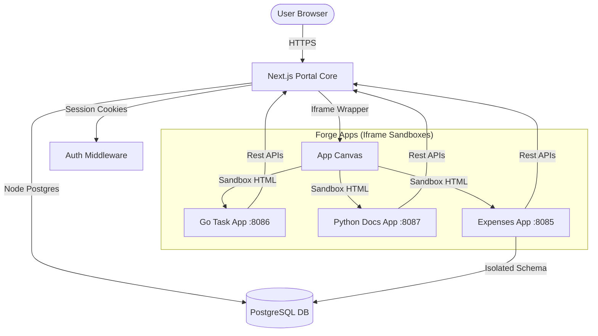
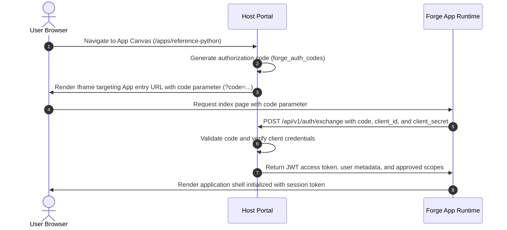

# SG Forge Architecture Guide

This document describes the design patterns, runtime models, database schema, and interface contracts that define SG Forge.

## 🏗 System Topology
SG Forge operates as a hybrid monolithic portal serving isolated micro-apps:

---

## 🛠 Core Components

### 1. Next.js Portal Core (src/frontend)
* **Routing:** App Router for portal interfaces, login pipelines, administrative consoles, and dynamic iframe canvases.
* **Middleware Guards:** 
  * `authGuard.ts` intercepts unauthenticated paths, enforcing standard user credential states and redirection to password updates if necessary.
  * `proxyGuard.ts` intercepts routing requests to `/forge-apps/[slug]` and `/api/forge-apps/[slug]`, validating hierarchical RBAC scopes before allowing frame access.

### 2. App Engine Registry & Manifest Scanner
* **Manifests (`app.json`):** Declares application identifiers, description metadata, entry points, target rules (designations, verticals, levels), and requested permission scopes.
* **Sync Pipeline (`src/backend/utils/manifestParser.ts`):** Scans folders under `src/apps/` on startup, upserting registries to the `forge_apps` database table, automatically generating unique Client ID and Client Secret values for app runtimes.

### 3. Hierarchical RBAC Permission Engine
* Resolves structural roles (e.g., `super_admin` down to `user`) dynamically using recursive Common Table Expressions (CTE).
* Automatically checks user designations, verticals, and level rules against app manifest target parameters.

---

## 🔐 Authentication Handshake Sequence
Apps do not read host cookies directly. Authentication is established via a secure, zero-trust token exchange:

---

## 🗄 Database Schema Matrix
The system stores its configurations in PostgreSQL across two primary categories:

* **Identity Structures:** `users`, `roles`, `permissions`, `role_permissions`, `user_roles`
* **Company Hierarchies:** `structural_metadata` (verticals, designations, departments, teams, groups)
* **Application Registries:** `forge_apps`, `forge_auth_codes`, `forge_access_tokens`
* **Logging Repository:** `system_logs` (stores rolling logs)
