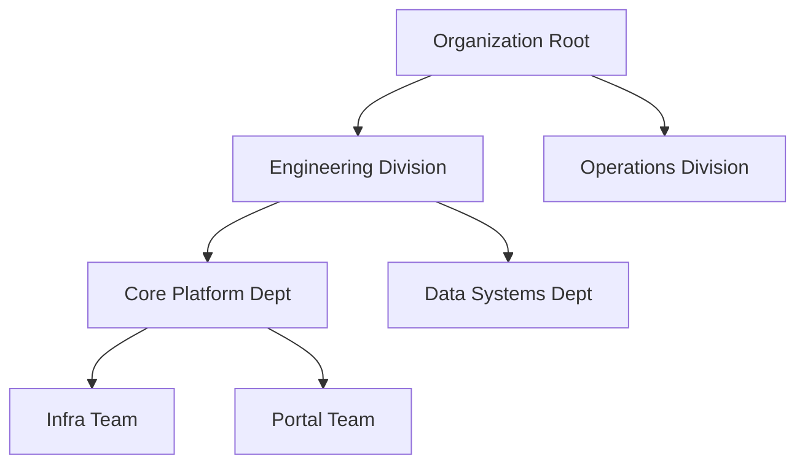
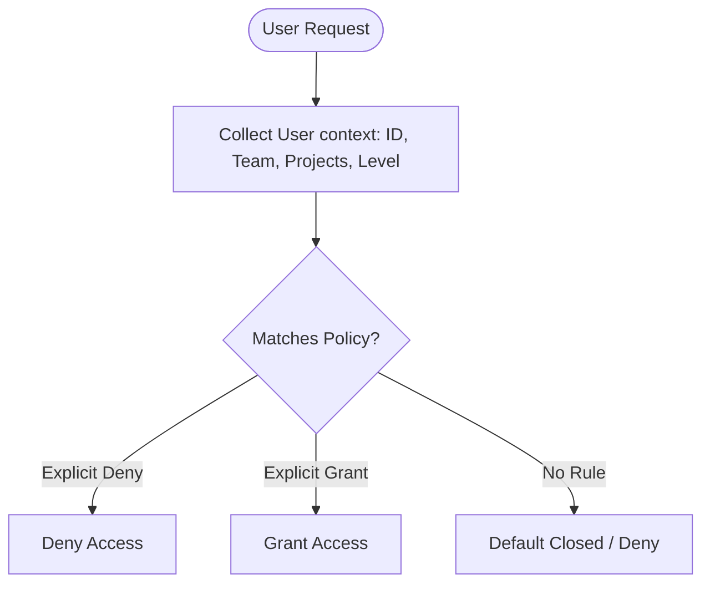
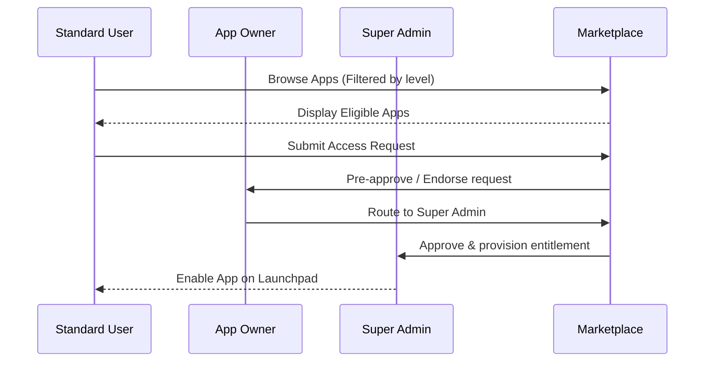

# Org Hierarchy & Marketplace

This document outlines the design and schema specifications for managing vertical reporting structures, horizontal matrix teams, and sandboxed application marketplace access.

---

## 1. Architectural Philosophy

1.  **Separation of Dimensions**: Vertical reporting lines (`org_nodes`) and horizontal collaborative teams (`projects`) are kept distinct.
2.  **Deny-Overrides-Grant**: Any explicit access denial rule overrides positive entitlement permissions.
3.  **No Graph Database Overhead**: Multi-level hierarchy resolution uses relational tables with recursive Common Table Expressions (CTEs), completing queries quickly.

---

## 2. Org Nodes Hierarchy (Vertical)

Instead of using hardcoded tables for departments, divisions, and teams, the system models the vertical reporting structure using a unified, self-referencing hierarchical tree.



### Table Structure
*   **`org_node_types`**: Configures allowed node classes (e.g. `company`, `division`, `department`, `team`, `pod`).
*   **`org_nodes`**: The self-referencing hierarchy tree containing `parent_id` foreign keys and a `metadata` JSONB field.
*   **`user_org_nodes`**: Connects users to nodes with relationships (`member`, `lead`, `manager`).

---

## 3. Matrix Projects (Horizontal)

While line managers follow the vertical reporting line (`org_nodes`), project collaboration crosses departments. Contributors from different teams are grouped under a Project.

```text
Vertical Hierarchy (org_nodes)       Horizontal Matrix (projects)
==============================       ============================
[Engineering Division]               [Project Omega]
  └── [Infra Team]                      ├── User A (Infra)
        └── User A  ────────────────────┤
  └── [Portal Team]                     │
        └── User B                      │
[Finance Division]                      │
  └── [Accounting Team]                 │
        └── User C  ────────────────────┘
```

### Table Structure
*   **`projects`**: Core project registry ledger containing manager identifiers, codes (`PROJ-OMEGA`), and project dates.
*   **`project_members`**: Roster mapping user allocations and roles inside a project.

---

## 4. App Entitlements Engine

Access controls evaluate rules applied to individuals, departments, projects, or role levels.

### Entitlements Resolution
When a user requests access to a sandboxed application, the engine compiles matching policies:



To prevent circular dependency loops in reporting relationships (e.g. User A reporting to User B, and User B reporting to User A), database insert/update operations trigger validation checks.

---

## 5. Marketplace Discoverability & Approval

Standard users can browse the App Marketplace to request application access.



*   **App Admins (`forge_app_admins`)**: App developers or business leads designated to review and endorse access requests for their application.
*   **Access Requests (`forge_app_access_requests`)**: Ledger of access requests, tracking statuses through review states (`pending_app_admin`, `pending_super_admin`, `approved`, `rejected`).

---

## 6. CSV Bulk Ingest & Data Onboarding

To onboard personnel records and configure the organizational reporting hierarchy at scale, administrators can import data using bulk ingestion templates.

### CSV Layout Specifications
The bulk-ingest CSV file must match this template structure:
```csv
EID,Name,Email,Role,Designation,Vertical,ManagerEID
E1001,John Doe,john.doe@company.com,user,Software Engineer,Engineering,
E1002,Jane Smith,jane.smith@company.com,user,Director,Engineering,E1001
E1003,Bob Johnson,bob.johnson@company.com,user,Team Lead,Engineering,E1002
```

### Ingestion Rules & Data Validation
1. **Case-Insensitive Resolution**: EID lookups and reporting links are queried case-insensitively using case-insensitive SQL functions.
2. **Metadata Auto-Provisioning**: Job Designations and Verticals that do not exist in the database are automatically created in the `structural_metadata` table.
3. **Admin Duty Segregation**: Standard users cannot report to administrative accounts. Admins and super admins are kept detached from the reporting tree.
4. **Reporting Cycle Prevention**: Database triggers and backend routers validate manager links. If an onboarding row references a manager EID that leads to a cycle (e.g. Employee A reporting to Employee B, and Employee B reporting to Employee A), the transaction fails validation.
