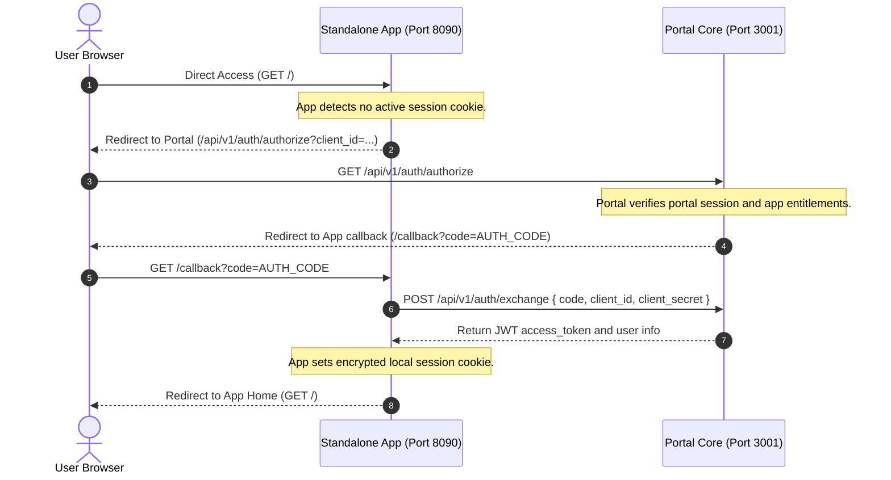

# Auth & Security Blueprint

This document outlines the security architecture, session protection, database constraints, and threat mitigation models of the SG Forge platform.

---

## 🎯 Threat Modeling & Mitigations

### 1. Privilege Escalation & Access Control
*   **Threat**: An employee with a standard role (e.g. designation L3 Software Engineer) attempts to access administrative apps (e.g. Nexus IT Provisioning) or administrative API endpoints.
*   **Mitigation**:
    *   The portal executes a strict Role-Based Access Control (RBAC) permission engine.
    *   Next.js edge middleware routes and intercepts requests, verifying that user designations, verticals, and level boundaries match the target application rules defined in `app.json`.

### 2. Cross-Frame Vulnerabilities (Iframe Sandboxing)
*   **Threat**: A malicious or compromised micro-app tries to read parent session details, hijack top-level page routing, or run cross-site scripting (XSS) on the portal domain.
*   **Mitigation**:
    *   All micro-applications are rendered inside `<iframe>` elements with strict sandbox parameters:
        ```html
        <iframe src="..." sandbox="allow-scripts allow-forms" />
        ```
    *   Omitting `allow-same-origin` forces the browser to treat the iframe as cross-origin, blocking direct access to parent cookies, local storage, or the DOM.
    *   Omitting `allow-top-navigation` prevents the child frame from redirecting the parent window URL.

### 3. Session Hijacking & Cookie Protection
*   **Threat**: Session tokens are read via client-side scripts or intercepted in transit.
*   **Mitigation**:
    *   Cookies are configured as `HttpOnly` (preventing script reads), `Secure` (restricting transmission to HTTPS), and `SameSite=Lax` (blocking CSRF access).
    *   Sessions are signed and encrypted using `iron-session` (AES-256-GCM symmetric encryption).

---

## 🗄 Database Isolation & Protections

### 1. Dedicated Read-Only Connection (`roDb`)
For analytical workbenches, the platform routes queries through a read-only database pool that enforces transaction restrictions:
```sql
SET SESSION CHARACTERISTICS AS TRANSACTION READ ONLY;
```
Any query attempting mutations (`INSERT`, `UPDATE`, `DELETE`, `DROP`) is terminated with a database-level driver exception.

### 2. SQL Workbench Keyword Filtering
The administrative SQL Workbench API (`/api/query`):
*   Blocks standard users with `403 Forbidden` responses.
*   For users with read-only admin privileges, the engine parses query strings and rejects commands matching destructive SQL keywords (`drop`, `delete`, `truncate`, `update`, `insert`, `alter`) before forwarding to the database driver.

---

## 🌐 Federated Single Sign-On (SSO) Protocol

To allow sandboxed micro-apps to run in separate browser tabs (as Service Providers) rather than inside iframes, the platform implements a Federated SSO Protocol.


