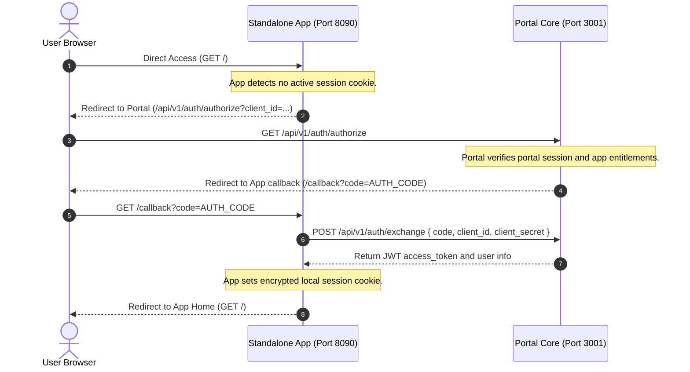

# Auth & Security Blueprint

This document outlines the security architecture, session protection, database constraints, and threat mitigation models of the SG Forge platform.

---

## 🎯 Threat Modeling & Mitigations

### 1. Privilege Escalation & Access Control
*   **Threat**: An employee with a standard role (e.g. designation L3 Software Engineer) attempts to access administrative apps (e.g. Nexus IT Provisioning) or administrative API endpoints.
*   **Mitigation**:
    *   The portal executes a strict Role-Based Access Control (RBAC) permission engine.
    *   Next.js edge middleware routes and intercepts requests, verifying that user designations, verticals, and level boundaries match the target application rules defined in `app.json`.

### 2. Cross-Frame Vulnerabilities (Iframe Sandboxing)
*   **Threat**: A malicious or compromised micro-app tries to read parent session details, hijack top-level page routing, or run cross-site scripting (XSS) on the portal domain.
*   **Mitigation**:
    *   All micro-applications are rendered inside `<iframe>` elements with strict sandbox parameters:
        ```html
        <iframe src="..." sandbox="allow-scripts allow-forms" />
        ```
    *   Omitting `allow-same-origin` forces the browser to treat the iframe as cross-origin, blocking direct access to parent cookies, local storage, or the DOM.
    *   Omitting `allow-top-navigation` prevents the child frame from redirecting the parent window URL.

### 3. Session Hijacking & Cookie Protection
*   **Threat**: Session tokens are read via client-side scripts or intercepted in transit.
*   **Mitigation**:
    *   Cookies are configured as `HttpOnly` (preventing script reads), `Secure` (restricting transmission to HTTPS), and `SameSite=Lax` (blocking CSRF access).
    *   Sessions are signed and encrypted using `iron-session` (AES-256-GCM symmetric encryption).

---

## 🗄 Database Isolation & Protections

### 1. Dedicated Read-Only Connection (`roDb`)
For analytical workbenches, the platform routes queries through a read-only database pool that enforces transaction restrictions:
```sql
SET SESSION CHARACTERISTICS AS TRANSACTION READ ONLY;
```
Any query attempting mutations (`INSERT`, `UPDATE`, `DELETE`, `DROP`) is terminated with a database-level driver exception.

### 2. SQL Workbench Keyword Filtering
The administrative SQL Workbench API (`/api/query`):
*   Blocks standard users with `403 Forbidden` responses.
*   For users with non-super-admin privileges, the engine parses query strings via a state-machine lexical tokenizer. It rejects commands matching destructive SQL keywords (`drop`, `delete`, `truncate`, `update`, `insert`, `alter`, `create`, `grant`, `revoke`, `copy`, `call`, `rename`, `do`, `execute`) and detects `EXPLAIN ANALYZE` write vectors before forwarding execution to the database driver.

---

## 🌐 Federated Single Sign-On (SSO) Protocol

To allow sandboxed micro-apps to run in separate browser tabs (as Service Providers) rather than inside iframes, the platform implements a Federated SSO Protocol.



### 🔑 Low-Latency Asymmetric Cryptography SSO (OAuth 2.1 / OIDC)

To optimize SSO handshake latency, prevent heavy database locks, and bypass schema size limits, the platform utilizes **Path B: Asymmetric JWTs**.

#### 🚀 How Low Latency is Achieved
* **Zero Database Lookups for Verification**: The Portal acts as the Identity Provider (IdP) and cryptographically signs issued JWT tokens using a private RSA key. Sandboxed micro-applications (using the Forge SDK) verify the signature completely offline using the public key, achieving **sub-millisecond (0ms DB query) token verification**.
* **Decentralized JSON Web Key Sets (JWKS)**: The Portal exposes its active public key at the JWKS endpoint `/api/v1/auth/jwks`. Service providers (micro-apps) call this endpoint once to retrieve and cache the key, verifying all subsequent API requests offline.
* **No Database Token Storage**: Newly generated JWT access tokens are not written to the `forge_access_tokens` table, avoiding write-locks and eliminating string-too-long limits on database columns.

#### 🛡 Security Safeguards
* **Short-Lived Access Tokens**: JWTs have a brief lifetime of **15 minutes** (900 seconds) to mitigate the impact of token interception.
* **Scope Constraints**: App access privileges are restricted strictly to requested OAuth scopes (e.g., `user.profile.read`, `audit.log.write`) encoded in the JWT claims payload.
* **Backward Compatibility**: If a token does not match the JWT format, the verification engine automatically falls back to a database lookup against the `forge_access_tokens` table. This prevents breaking changes for older, legacy applications.

---

## 🔑 Third-Party OAuth2 Identity Providers (SSO)

To facilitate passwordless corporate access and seamless workforce onboarding, the platform supports authenticating users via external Identity Providers (Google Workspace, GitHub Organizations, Microsoft Entra ID, and Okta).

### Security Architecture

1. **CSRF Protection via Session-bound State**:
   - During redirection, a cryptographically secure, random `state` token (`crypto.randomUUID()`) is generated and stored in a short-lived, HTTP-only, secure cookie (`oauth_state`).
   - The returning callback must present a matching `state` query parameter, blocking Cross-Site Request Forgery (CSRF) attempts.
2. **Dynamic Endpoint Host Resolution**:
   - Redirect callback URIs are resolved dynamically from request headers (`x-forwarded-proto` and `host`). This eliminates hardcoded application URLs, enabling zero-configuration deployments on corporate intranets and dev proxies.
3. **Data Collection Scope Minimization**:
   - The platform strictly requests basic scopes (`openid`, `email`, `profile` / `User.Read`) to retrieve only the user's verified **email address** and **full name**. No access is requested for calendars, directories, files, or sensitive organizational resources.

### Auto-Registration & User Provisioning

When a third-party login completes successfully:
- The system queries the database for an existing user account matching the provider's verified email.
- **If the user exists**, they are signed in directly by setting the secure `session_token` cookie.
- **If the user does not exist**, the portal automatically provisions a new employee profile:
  - Generates a unique employee ID (`eid`) using the format `E_OA_<random_5_digits>`.
  - Sets the password hash to a secure placeholder `OAUTH_USER_NO_PASSWORD` (preventing standard credential-matching logins).
  - Marks `isPasswordChanged` as `true` (skipping the initial password change wizard since they authenticated externally).
  - Sets their role to the default `user`.

