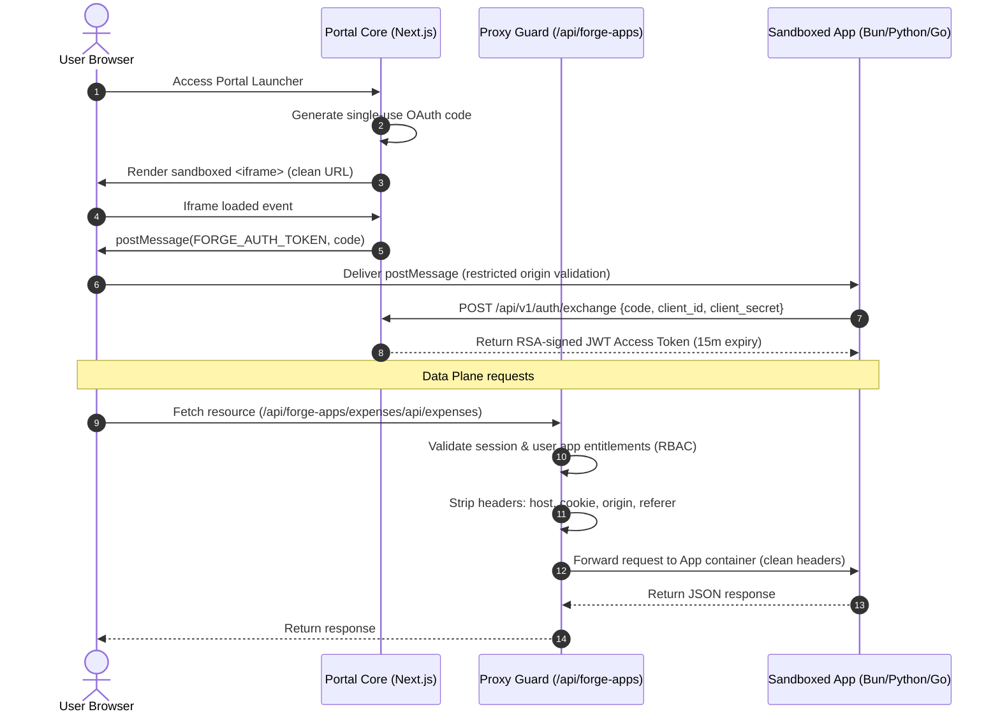
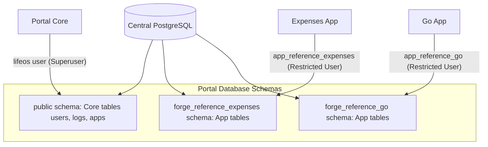

# 🔒 SG Forge & Portal Core: Security Audit & Architecture Review
**Author:** Lead Security Analyst, Google  
**Date:** June 20, 2026  
**Status:** Completed Review (With Resolved Mitigations)  

---

## 📋 Executive Summary
This document provides an honest, end-to-end security analysis of the SG Forge platform (Portal Core) and its sandboxed micro-applications (Forge Apps). It evaluates communication protocols, data persistence mechanisms, credential handling, and container isolation boundaries.

While SG Forge incorporates strong modern security paradigms (such as asymmetric JWT token verification, iframe sandboxing, and request header sanitization), several **critical architectural gaps** were identified in the database access layer and sandbox process execution. 

> [!NOTE]
> As of **June 20, 2026**, the database role segregation, shell command execution, and network isolation gaps have been fully mitigated and verified.

---

## 🌐 1. Communication Architecture

The communication architecture of SG Forge is split into two distinct planes: the Control Plane (Portal Core) and the Data Plane (Application Reverse Proxy).



### Key Communications Protocols & Mitigations:
1. **Control Plane Handshake (OAuth 2.1 / OIDC BCP)**:
   - **Zero URL Leakage**: In compliance with 2026 standards, the authorization code is no longer passed as a query parameter in the iframe `src`. This eliminates exposure in browser history, proxy server logs, and the `Referer` header.
   - **In-Memory Transport**: The parent window posts the short-lived authorization code directly into the sandboxed iframe using `postMessage` only after the frame is loaded.
   - **Origin Verification**: The Forge SDK client resolves the parent portal origin using `document.referrer` and `window.location.ancestorOrigins` to bypass opaque origin restrictions in sandboxed frames, discarding any messages from untrusted origins.
   - **Asymmetric Signature Offline Validation**: The portal signs JWT tokens using a private RSA key. App containers verify signatures offline using the JWKS public keys (`/api/v1/auth/jwks`), resulting in sub-millisecond validation with zero database locks.

2. **Data Plane (Reverse Proxy Guard)**:
   - All client API calls are routed through `/api/forge-apps/[slug]/[[...path]]`.
   - The proxy acts as a security barrier, verifying user credentials and RBAC rules (verticals, designations, min job levels) prior to routing.
   - **Header Sanitization**: To prevent session fixation, CSRF, or server-side request forgery (SSRF), the proxy strips sensitive request headers: `host`, `cookie`, `origin`, and `referer`.

---

## 🗄 2. Data Persistence & Schema Isolation

SG Forge implements automatic database schema isolation for applications requesting local database storage (`requiresIsolatedSchema: true` in `app.json`).



### Persistence Control Assessment:
1. **Automated Schema Provisioning**:
   - The manifest parser scan reads `database.schemaName` and executes `CREATE SCHEMA IF NOT EXISTS <schemaName>` during app registration.
   - Tenant schemas are segregated under individual namespaces (e.g. `forge_reference_expenses`).
2. **Read-Only Database Connection Pool (`roDb`)**:
   - Enforces read-only transactions (`SET SESSION CHARACTERISTICS AS TRANSACTION READ ONLY;`) for analytical and reporting dashboards, preventing mutation attacks.
3. **Keyword-Based Query Filtering**:
   - The SQL workbench API performs blacklist check on SQL keywords (`drop`, `truncate`, `delete`, `update`, `insert`) before executing analytical queries to mitigate SQL injections.

---

## ⚠️ 3. Security Gaps & Mitigations Status

### 🟢 Gap A: Shared High-Privilege Database Credentials (RESOLVED)
*   **Issue**: Sandboxed applications (Go, Node, Python) were previously provisioned with the exact same `DATABASE_URL` connecting as the superuser/owner `lifeos`.
*   **Threat**: Schema separation was purely logical. Compromise of a single sandboxed micro-app could allow an attacker to query core portal tables, drop other app schemas, read audit logs, or manipulate tenant records.
*   **Mitigation**: 
    1. Dedicated PostgreSQL roles are dynamically created (`app_reference_expenses`, `app_reference_go`, and `app_reference_python`) with custom passwords during database initialization.
    2. Connection strings containing these restricted roles are automatically swapped out on startup via `dynamic-app-runner.ts` (for native/local process execution) and mapped within `docker-compose.yaml` files (for containerized execution).
    3. Privileges are strictly isolated: app roles only have read-only access (`SELECT`) to specific core public tables (`users`, `forge_access_tokens`, `forge_apps`) and have zero write capabilities outside of their designated, isolated database schemas.

### 🟢 Gap B: Shell Command Injection / psql Subprocess Execution (RESOLVED)
*   **Issue**: The `reference-python` application (`server.py`) and other apps queried client credentials by executing a shell subprocess or direct SQL query:
    ```python
    cmd = ["psql", DATABASE_URL, "-t", "-A", "-c", "SELECT client_id, client_secret FROM forge_apps WHERE slug = 'reference-python'"]
    ```
*   **Threat**: 
    1. **Command Injection**: Vulnerable to argument injection via manipulated environment parameters.
    2. **Escalation**: Sandbox apps directly querying core tables (`forge_apps`) could read credentials belonging to other apps.
    3. **Bloat**: Required container environments to install client-side PostgreSQL CLI binaries.
*   **Mitigation**: 
    1. Static, secure developer credentials are declared directly inside `app.json` manifests (`clientId` and `clientSecret`).
    2. These credentials are dynamically injected into container runtime environments (`CLIENT_ID` and `CLIENT_SECRET`) via `docker-compose.yaml`.
    3. The application backends (`server.py`, `main.go`, `server.ts`) read credentials directly from environment variables first, bypassing the `psql` subprocess / database queries entirely.

### 🟢 Gap C: Missing Network Level Isolation (RESOLVED)
*   **Issue**: Previously, all applications were mounted on the same docker network bridge, allowing them to communicate directly and establish raw TCP connections to the central database container.
*   **Threat**: Lateral network movement. A compromised sandbox app could bypass portal core proxy API policies.
*   **Mitigation**: 
    1. Segmented network layers have been configured inside Docker Compose configurations:
       - `db-core-net`: Exclusively connects the `db` and `app` containers.
       - `db-expenses-net`: Connects `db` and `reference-expenses` containers.
       - `db-go-net`: Connects `db` and `reference-go` containers.
       - `portal-net`: Connects the main `app` container and all sandbox applications.
    2. Sandbox microservices without database dependencies (`reference-python` and `telemetry-dashboard`) are completely isolated on `portal-net` and have no network route to the database container `db`.
    3. Host access is routed strictly through the gateway proxy container.

---

## 🛠 4. Actionable Recommendations (2026 Standards)

To maintain compliance and further secure the architecture:

### 1. Upgrade SQL Workbench to AST Parsing
- **Action**: Replace string-based keyword blacklists.
- **Fix**: String blacklisting is easily bypassed (e.g. using comments `/* ... */` or hex encoding). Implement an AST (Abstract Syntax Tree) SQL parser in the query middleware to inspect the statement structure and strictly enforce read-only execution.

### 2. Implement Automated Client Secret Rotation
- **Action**: Rotate client secrets dynamically.
- **Fix**: Configure an automated secret management lifecycle (e.g. HashiCorp Vault, AWS Secrets Manager, or Google Secret Manager) to rotate client secrets periodically and update the injected container variables without manual intervention.
