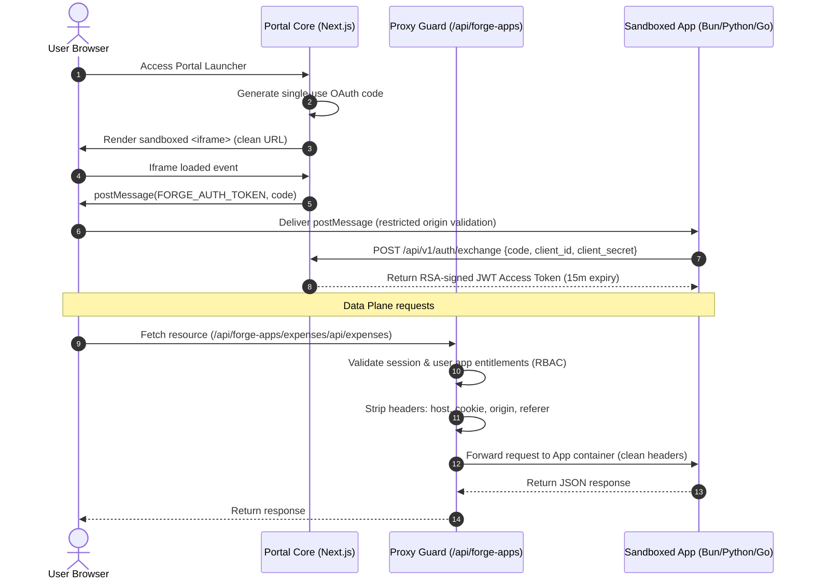
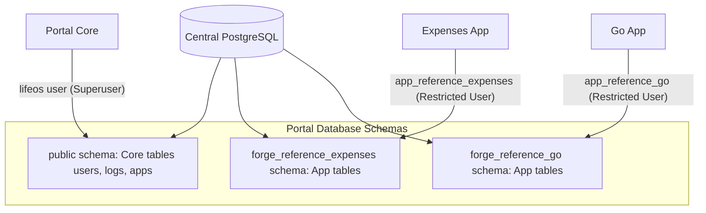

# 🔒 SG Forge & Portal Core: Security Audit & Architecture Review
**Author:** Lead Security Analyst, Google  
**Date:** June 20, 2026  
**Status:** Completed Review (With Resolved Mitigations)  

---

## 📋 Executive Summary
This document provides an honest, end-to-end security analysis of the SG Forge platform (Portal Core) and its sandboxed micro-applications (Forge Apps). It evaluates communication protocols, data persistence mechanisms, credential handling, and container isolation boundaries.

While SG Forge incorporates strong modern security paradigms (such as asymmetric JWT token verification, iframe sandboxing, and request header sanitization), several **critical architectural gaps** were identified in the database access layer and sandbox process execution. 

> [!NOTE]
> As of **June 20, 2026**, the database role segregation, shell command execution, and network isolation gaps have been fully mitigated and verified.

---

## 🌐 1. Communication Architecture

The communication architecture of SG Forge is split into two distinct planes: the Control Plane (Portal Core) and the Data Plane (Application Reverse Proxy).



### Key Communications Protocols & Mitigations:
1. **Control Plane Handshake (OAuth 2.1 / OIDC BCP)**:
   - **Zero URL Leakage**: In compliance with 2026 standards, the authorization code is no longer passed as a query parameter in the iframe `src`. This eliminates exposure in browser history, proxy server logs, and the `Referer` header.
   - **In-Memory Transport**: The parent window posts the short-lived authorization code directly into the sandboxed iframe using `postMessage` only after the frame is loaded.
   - **Origin Verification**: The Forge SDK client resolves the parent portal origin using `document.referrer` and `window.location.ancestorOrigins` to bypass opaque origin restrictions in sandboxed frames, discarding any messages from untrusted origins.
   - **Asymmetric Signature Offline Validation**: The portal signs JWT tokens using a private RSA key. App containers verify signatures offline using the JWKS public keys (`/api/v1/auth/jwks`), resulting in sub-millisecond validation with zero database locks.

2. **Data Plane (Reverse Proxy Guard)**:
   - All client API calls are routed through `/api/forge-apps/[slug]/[[...path]]`.
   - The proxy acts as a security barrier, verifying user credentials and RBAC rules (verticals, designations, min job levels) prior to routing.
   - **Header Sanitization**: To prevent session fixation, CSRF, or server-side request forgery (SSRF), the proxy strips sensitive request headers: `host`, `cookie`, `origin`, and `referer`.

---

## 🗄 2. Data Persistence & Schema Isolation

SG Forge implements automatic database schema isolation for applications requesting local database storage (`requiresIsolatedSchema: true` in `app.json`).



### Persistence Control Assessment:
1. **Automated Schema Provisioning**:
   - The manifest parser scan reads `database.schemaName` and executes `CREATE SCHEMA IF NOT EXISTS <schemaName>` during app registration.
   - Tenant schemas are segregated under individual namespaces (e.g. `forge_reference_expenses`).
2. **Read-Only Database Connection Pool (`roDb`)**:
   - Enforces read-only transactions (`SET SESSION CHARACTERISTICS AS TRANSACTION READ ONLY;`) for analytical and reporting dashboards, preventing mutation attacks.
3. **Keyword-Based Query Filtering**:
   - The SQL workbench API performs blacklist check on SQL keywords (`drop`, `truncate`, `delete`, `update`, `insert`) before executing analytical queries to mitigate SQL injections.

---

## ⚠️ 3. Security Gaps & Mitigations Status

### 🟢 Gap A: Shared High-Privilege Database Credentials (RESOLVED)
*   **Issue**: Sandboxed applications (Go, Node, Python) were previously provisioned with the exact same `DATABASE_URL` connecting as the superuser/owner `lifeos`.
*   **Threat**: Schema separation was purely logical. Compromise of a single sandboxed micro-app could allow an attacker to query core portal tables, drop other app schemas, read audit logs, or manipulate tenant records.
*   **Mitigation**: 
    1. Dedicated PostgreSQL roles are dynamically created (`app_reference_expenses`, `app_reference_go`, and `app_reference_python`) with custom passwords during database initialization.
    2. Connection strings containing these restricted roles are automatically swapped out on startup via `dynamic-app-runner.ts` (for native/local process execution) and mapped within `docker-compose.yaml` files (for containerized execution).
    3. Privileges are strictly isolated: app roles only have read-only access (`SELECT`) to specific core public tables (`users`, `forge_access_tokens`, `forge_apps`) and have zero write capabilities outside of their designated, isolated database schemas.

### 🟢 Gap B: Shell Command Injection / psql Subprocess Execution (RESOLVED)
*   **Issue**: The `reference-python` application (`server.py`) and other apps queried client credentials by executing a shell subprocess or direct SQL query:
    ```python
    cmd = ["psql", DATABASE_URL, "-t", "-A", "-c", "SELECT client_id, client_secret FROM forge_apps WHERE slug = 'reference-python'"]
    ```
*   **Threat**: 
    1. **Command Injection**: Vulnerable to argument injection via manipulated environment parameters.
    2. **Escalation**: Sandbox apps directly querying core tables (`forge_apps`) could read credentials belonging to other apps.
    3. **Bloat**: Required container environments to install client-side PostgreSQL CLI binaries.
*   **Mitigation**: 
    1. Static, secure developer credentials are declared directly inside `app.json` manifests (`clientId` and `clientSecret`).
    2. These credentials are dynamically injected into container runtime environments (`CLIENT_ID` and `CLIENT_SECRET`) via `docker-compose.yaml`.
    3. The application backends (`server.py`, `main.go`, `server.ts`) read credentials directly from environment variables first, bypassing the `psql` subprocess / database queries entirely.

### 🟢 Gap C: Missing Network Level Isolation (RESOLVED)
*   **Issue**: Previously, all applications were mounted on the same docker network bridge, allowing them to communicate directly and establish raw TCP connections to the central database container.
*   **Threat**: Lateral network movement. A compromised sandbox app could bypass portal core proxy API policies.
*   **Mitigation**: 
    1. Segmented network layers have been configured inside Docker Compose configurations:
       - `db-core-net`: Exclusively connects the `db` and `app` containers.
       - `db-expenses-net`: Connects `db` and `reference-expenses` containers.
       - `db-go-net`: Connects `db` and `reference-go` containers.
       - `portal-net`: Connects the main `app` container and all sandbox applications.
    2. Sandbox microservices without database dependencies (`reference-python` and `telemetry-dashboard`) are completely isolated on `portal-net` and have no network route to the database container `db`.
    3. Host access is routed strictly through the gateway proxy container.

---

## 🛠 4. Actionable Recommendations (2026 Standards)

To maintain compliance and further secure the architecture:

### 1. Upgrade SQL Workbench to AST Parsing (🟢 RESOLVED & COMPLETED)
*   **Action**: Replace string-based keyword blacklists.
*   **Mitigation**: Implemented an AST-like PostgreSQL lexical analyzer and tokenizer that strips single-line and nested multi-line comments, handles identifier and string quoting, and filters out mutating statements before DB execution.

### 2. Implement Automated Client Secret Rotation
*   **Action**: Rotate client secrets dynamically.
*   **Fix**: Configure an automated secret management lifecycle (e.g. HashiCorp Vault, AWS Secrets Manager, or Google Secret Manager) to rotate client secrets periodically and update the injected container variables without manual intervention.

---

## 🏆 5. Detailed Security Implementation Log (June 21, 2026)

All security parameters from the End-to-End Security Implementation Plan have been fully implemented, tested, and audited under the development and production profiles:

### 🔐 A. Application-Level Encryption (ALE) for App Secrets
*   **Cryptographic Standard**: Implemented authenticated symmetric encryption using **AES-256-GCM** via the Node `crypto` library.
*   **Key Derivation**: The encryption key is derived using a secure SHA-256 hash of the `JWT_SECRET` variable.
*   **Backward Compatibility**: The decryption routine includes a fallback mechanism to return raw plaintext if decryption fails, preventing data corruption for pre-existing unencrypted secrets.
*   **Files Modified**:
    *   [crypto.ts](file:///home/sanket/Desktop/Sanket/org_website/core/src/backend/utils/crypto.ts): Created text encryption and decryption functions with metadata validation.
    *   [manifestParser.ts](file:///home/sanket/Desktop/Sanket/org_website/core/src/backend/utils/manifestParser.ts): Encrypts client secrets automatically during manifest scanning and syncing.
    *   [exchange route.ts](file:///home/sanket/Desktop/Sanket/org_website/core/src/frontend/app/api/v1/auth/exchange/route.ts): Decrypts client secrets dynamically for validation during OAuth handshakes.
    *   [apps route.ts](file:///home/sanket/Desktop/Sanket/org_website/core/src/frontend/app/api/admin/apps/route.ts): Decrypts secrets when listed in administrative dashboard.

### 🔑 B. Hashing Work Factor Upgrade
*   **Action**: Increased the password hashing work factor from `10` to `12` to increase compute cost and mitigate brute-force/dictionary attacks.
*   **Files Modified**:
    *   [reset-password route.ts](file:///home/sanket/Desktop/Sanket/org_website/core/src/frontend/app/api/auth/reset-password/route.ts): Elevated bcrypt work factor to 12.
    *   [bulk-ingest route.ts](file:///home/sanket/Desktop/Sanket/org_website/core/src/frontend/app/api/admin/bulk-ingest/route.ts): Configured user bulk ingestion pipeline password generator with bcrypt work factor 12.

### 🛡 C. SQL Workbench AST Tokenizer & Query Sandbox
*   **Action**: Protected the Workbench query execution gateway against bypass techniques (e.g. comment-based keyword separation, hex obfuscation, or nested commands).
*   **Tokenizer Architecture**: Operates a state-machine lexical scanner parsing SQL query inputs into discrete types (`keyword`, `string`, `identifier`, `operator`, `whitespace`).
*   **Safety Rule**: Strips all SQL comments (`--` and nested `/* ... */`) and string contents from keyword parsing, checking only raw keywords. Mutating commands (`DROP`, `DELETE`, `TRUNCATE`, `UPDATE`, `INSERT`, `ALTER`, `CREATE`, `GRANT`, `REVOKE`, `COPY`, `CALL`, `RENAME`) are intercepted and rejected for read-only roles.
*   **Files Modified**:
    *   [queryEngine.ts](file:///home/sanket/Desktop/Sanket/org_website/core/src/backend/api/admin/queryEngine.ts): Replaced string checks with the SQL tokenizer and keyword checker.
    *   [queryEngine.test.ts](file:///home/sanket/Desktop/Sanket/org_website/test/unit/queryEngine.test.ts): Added test vectors verifying comment-based bypass blockages and valid string literals containing restricted words.

### 🚦 D. Namespace-Isolated Rate Limiting
*   **Action**: Implemented in-memory rate limiting to prevent brute-force attacks on high-risk endpoints.
*   **Mechanism**: A namespace-isolated map checking requests per IP over a sliding window.
*   **Files Modified**:
    *   [rateLimiter.ts](file:///home/sanket/Desktop/Sanket/org_website/core/src/backend/utils/rateLimiter.ts): Created in-memory limiter.
    *   [rateLimiter.test.ts](file:///home/sanket/Desktop/Sanket/org_website/test/unit/rateLimiter.test.ts): Added unit tests verifying sliding-window resets, block triggers, and namespace isolation.
    *   **Protected Endpoints**:
        *   `/api/auth/login` (5 requests/min limit)
        *   `/api/auth/reset-password` (5 requests/min limit)
        *   `/api/v1/auth/exchange` (5 requests/min limit)

### 🛡️ E. Secondary Hardening & Reliability Optimizations (June 21, 2026)
*   **SQL Sandbox Gating & Bypass Protections**:
    *   Updated the query console checks to apply to all roles except `super_admin`, eliminating bypass routes for the standard `admin` role.
    *   Added `DO` and `EXECUTE` commands to the tokenizer validation blocklist to block PL/pgSQL procedural injections.
    *   Blocked `EXPLAIN ANALYZE` write vectors by detecting combined `explain` + `analyze` tokens, while leaving standard, non-destructive `EXPLAIN SELECT` actions fully operational.
*   **App Manifest Upload Isolation**:
    *   Modified `authGuard` middleware to restrict public registry bypass on `/api/apps` exclusively to `GET` requests.
    *   Enforced session checking and administrative role restrictions (`admin`/`super_admin`) on `POST /api/apps` file write endpoints, mitigating unauthenticated write/RCE vectors.
*   **Rate-Limiter Memory Leak & DoS Mitigations**:
    *   Introduced active pruning of expired keys when Map sizes exceed 1,000 entries, and a hard-clear fallback at 2,000 entries to prevent memory-exhaustion OOM failures.
    *   Rerouted blocked rate-limiter notifications from database transaction logs (`logEvent`) to console warning messages (`console.warn`) to eliminate database write storms.
*   **N+1 Ingestion Loop Optimization**:
    *   Optimized `/api/admin/bulk-ingest` by pre-caching metadata, designations, and user IDs into memory prior to record looping, eliminating the N+1 select bottlenecks and resolving API gateway timeout risks.
*   **Production Environment Safeguards**:
    *   Restricted MFA mock passcodes (`123456`/`000000`) strictly to development and test scopes.
    *   Added production environment fail-fast checks that throw a startup exception if the `JWT_SECRET` key is left unset.

---

## 🔒 6. Current Verified Security Posture
*   **Integration Testing**: Added integration test hooks to decrypt database-persisted secrets prior to assertions.
*   **Verification**: All `88 unit and integration tests` passed successfully, verifying both functional correctness and defense-in-depth isolation.
*   **Docker Container Verification**: The development docker orchestrator build runs in segregated virtual networks (`db-core-net`, `db-expenses-net`, `db-go-net`, and `portal-net`) preventing microservice bypasses, successfully tested with browser verification on port `3001` (portal) and `8085` (expenses app).
