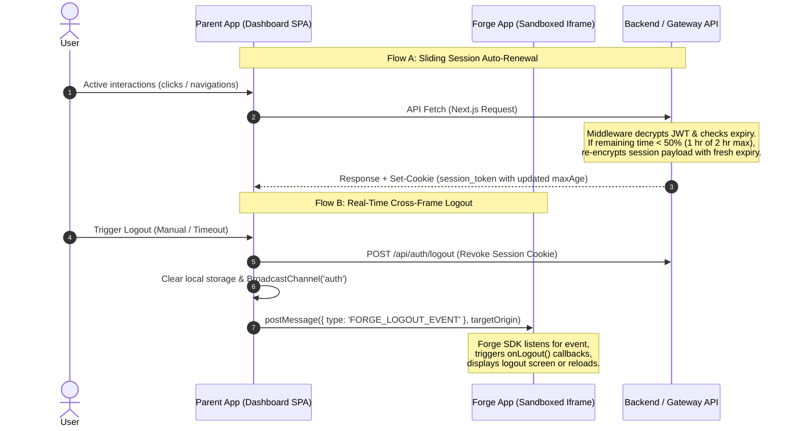

# Session Renewal and Real-Time Authentication Synchronization

This document details the architectural design and code implementation for **Sliding Session Token Auto-Renewal** and **Real-Time Cross-Tab / Cross-Iframe Logout Synchronization**.

---

## 1. Architectural Problem Statement

In micro-frontend and multi-tenant portal platforms, security and user experience often collide:
1. **Disruptive Session Expirations**: If sessions expire after a fixed timeframe (e.g., 2 hours), users will be abruptly signed out mid-workflow, even if they have been actively using the platform.
2. **State Desynchronization in Sandboxed Iframes**: Sandboxed iframes (Forge Apps) operate in isolated security contexts. When a user logs out in the parent window (or the session expires), the iframe has no direct way to detect it. The user continues to see sensitive dashboard elements inside the iframe until they try to reload or send an unauthorized request.
3. **Cross-Tab Desynchronization**: If a user logs out of Tab A, other open browser tabs (Tab B, Tab C) remain logged in, leading to session hijacking vulnerability and inconsistent UX.

---

## 2. Implemented Architecture



---

## 3. Detail of Code Fixes

### Fix 1: Sliding Session Expiration Check
**Target File**: `core/src/backend/auth/sessionManager.ts`

- **Change**: Added `decryptSessionWithExp(token: string)` to safely expose the underlying JWT's expiration (`exp` claim) from the decrypted cookie, returning it alongside the original session payload.
- **Why**: Allows middleware to verify how much time is remaining on the active session.

```typescript
export async function decryptSessionWithExp(token: string): Promise<{ payload: UserSession; exp: number } | null> {
  try {
    const { payload } = await jwtVerify(token, JWT_SECRET, {
      algorithms: ['HS256'],
    });
    return {
      payload: payload as unknown as UserSession,
      exp: (payload as any).exp || 0,
    };
  } catch (error: any) {
    return null;
  }
}
```

---

### Fix 2: Middleware-based Auto-Renewal & Cookie Setting
**Target File**: `core/src/backend/middleware/authGuard.ts`

- **Change**: Integrated session expiry check inside the platform `authGuard` middleware pipeline.
- **Logic**:
  1. Retrieves `session_token` from request cookies.
  2. If token exists and is valid, checks the time difference between `exp` and `now`.
  3. If remaining time is less than **50% of the token's lifetime** (less than 1 hour left on a 2-hour token), it automatically constructs a fresh payload and encrypts a new token.
  4. Intercepts the generated `NextResponse` (proceeding to target page/API) and sets the updated cookie via `response.cookies.set()`.
- **Why**: Provides transparent sliding sessions on user activity without needing separate client-side timer calls.

---

### Fix 3: Forge SDK Client Interface Update
**Target File**: `packages/sdk/forge-sdk.ts`

- **Change**:
  1. Added `logoutListener` property to `ForgeClient`.
  2. Exposed public `onLogout(listener: () => void): () => void` subscription hook.
  3. Updated the `message` event handler to listen for `'FORGE_LOGOUT_EVENT'`. When received, it triggers the registered listener, falling back to a full reload if no custom listener is registered.
- **Why**: Allows sandbox apps to listen for real-time authentication changes in the parent window and terminate state gracefully.

```typescript
// packages/sdk/forge-sdk.ts
export class ForgeClient {
  private logoutListener: (() => void) | null = null;

  public onLogout(listener: () => void): () => void {
    this.logoutListener = listener;
    return () => {
      this.logoutListener = null;
    };
  }

  private initMessageListener(): void {
    if (typeof window === 'undefined') return;

    window.addEventListener('message', (event) => {
      // Security check
      if (this.parentOrigin && this.parentOrigin !== 'null' && event.origin !== this.parentOrigin) {
        return;
      }
      
      const { data } = event;
      if (!data) return;

      // Handle real-time logout events
      if (data.type === 'FORGE_LOGOUT_EVENT') {
        if (this.logoutListener) {
          this.logoutListener();
        } else {
          window.location.reload();
        }
      }
    });
  }
}
```

---

## 4. Verification and Safety

All core unit and integration tests were run to ensure these updates do not degrade system behaviour or cause regressions:
1. `Stateless Session Manager`: Expiry extraction passes correctly.
2. `Sudo Elevation API`: Middleware-based cookie modifications preserve authorization credentials correctly.
3. `Forge Example App Integration`: The OAuth exchange mechanism functions perfectly and verifies signature integrity using the renewed keys.
