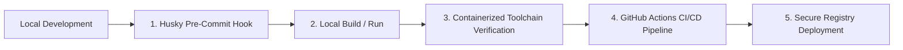

# 🔄 Secure Software Development Lifecycle (SSDLC) Blueprint

This document details the automated gates, static analysis checks, containerized toolchain, and CI/CD security rules that govern code quality, boundaries, and security across the SG Forge repository.

---

## 📋 SSDLC Architecture

SG Forge enforces security checks at every phase of the development lifecycle, from local changes to pull request merge:



---

## 🛠 1. Local Pre-Commit Validation (Husky Gates)

To prevent security vulnerabilities, syntax errors, or architectural degradation from reaching remote branches, the repository leverages Git pre-commit hooks managed by **Husky** (`.husky/pre-commit` calling `toolchain/run-precommit.sh`).

The hook identifies staged files and runs targeted, optimized checks:

| Language/Asset | Check Tool | Purpose & Security Scope |
| :--- | :--- | :--- |
| **JS / TS / JSON / CSS** | **Biome** | Syntax verification, code formatting, and semantic linting. |
| **Python** | **Ruff** | Fast static analysis, detection of vulnerable patterns, and unused imports. |
| **Go** | **golangci-lint** | Concurrency safety checks, performance anti-patterns, and code complexity. |
| **SQL Schemas** | **SQLFluff** | Enforces Postgres-compliant schema formatting and clean DDL rules. |
| **Architectural Boundaries** | **Dependency-Cruiser** | Prevents module boundary violations and circular dependency chains. |

---

## 🐳 2. Containerized Toolchain Platform

To eliminate the "works on my machine" class of bugs and guarantee absolute parity between local environments and CI/CD pipelines, all verification routines are containerized. 

The orchestrator script `./run.sh toolchain` runs tasks inside a controlled Docker environment (`toolchain/docker-compose.yml`):

### Available Verification Suites:
1. **Linter & Formatting Check**:
   ```bash
   ./run.sh toolchain lint
   ```
   Runs syntax checkers (Biome, Ruff, golangci-lint, SQLFluff, and Boundary checkers) across the entire monorepo.
   
2. **Security & Vulnerability Auditing**:
   ```bash
   ./run.sh toolchain security
   ```
   Scans the repository for hardcoded secrets, cryptographic keys, credentials leakages, and runs open-source vulnerability dependency audits (SAST).
   
3. **Automated Testing**:
   ```bash
   ./run.sh toolchain test
   ```
   Executes the frontend, backend, and integration tests with coverage mappings.
   
4. **Documentation Compilation**:
   ```bash
   ./run.sh toolchain docs
   ```
   Builds the architectural documentation site locally using MkDocs.

5. **Sequence Run**:
   ```bash
   ./run.sh toolchain all
   ```
   Sequentially executes linting, security scanning, test coverage, and documentation builds.

---

## 🔒 3. Architectural Boundary Controls

The repository implements strict package boundary separation using `dependency-cruiser` configured in `.dependency-cruiser.json`. This ensures:
*   **Sandbox Isolation**: Reference applications (Expenses, Python, Go) cannot directly import packages or classes from the Portal Core (`core/src`).
*   **Decoupled SDK Contracts**: The SDK packages (`packages/sdk`) are self-contained and compile independently of the server platform.
*   **Circular Import Prevention**: Enforces a strict directed acyclic graph (DAG) across components to prevent complex dependency loops.

---

## 🚀 4. CI/CD Integration (GitHub Actions)

Upon opening a Pull Request or pushing to main branches, GitHub Actions (`.github/workflows/ci.yml`) runs the same containerized toolchain tasks:
1. Builds the `toolchain` Docker container.
2. Runs the exact same commands `./run.sh toolchain all` verifying lints, security, tests, and docs.
3. Automatically blocks pull request merges if any pre-commit or security checks fail.

---

## 🛡 5. Static Analysis (SAST) & Secrets Bypass Policy

To maintain a secure development posture and prevent security regression, the following strict regulations govern the bypass or suppression of static security scan warnings:

### A. SAST (Semgrep) Suppressions (`// nosemgrep`)
*   **Input Validation Requirement**: Suppressing a SAST warning is strictly prohibited unless robust runtime sanitization (such as allowlisting, alphanumeric type checks, or regular expression matching) is implemented immediately before the affected statement.
*   **Rule Granularity**: Avoid using generic `// nosemgrep` comments that suppress all rules. Developers should specify the exact rule ID (e.g., `// nosemgrep: javascript.lang.security.audit.path-traversal.path-join-resolve-traversal`) where possible.
*   **Placement**: For multi-line statements, place the comment on the exact line flagged by Semgrep (typically the line containing the string interpolation or vulnerable variable lookup).
*   **Documentation**: Precede every suppression directive with a code comment explaining the safety context and referencing the mitigation logic.

### B. Secrets & Credential Leakage Suppressions
*   **No Hardcoded Secrets**: Under no circumstances should real secret credentials or API tokens be committed to Git, even with a bypass comment (like `# gitleaks:allow`).
*   **Config Isolation**: All secrets must be dynamically injected via environment variables (`process.env` or container env bindings) or sourced from verified configuration vaults.
*   **Allowed Exceptions**: False positives during local test suites using explicitly marked dummy test vectors (e.g., `authenticated_sunil_dev`) must be documented and scoped strictly to test files.
