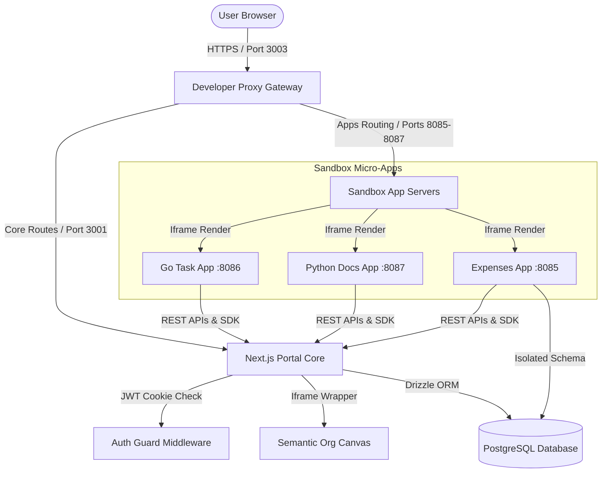
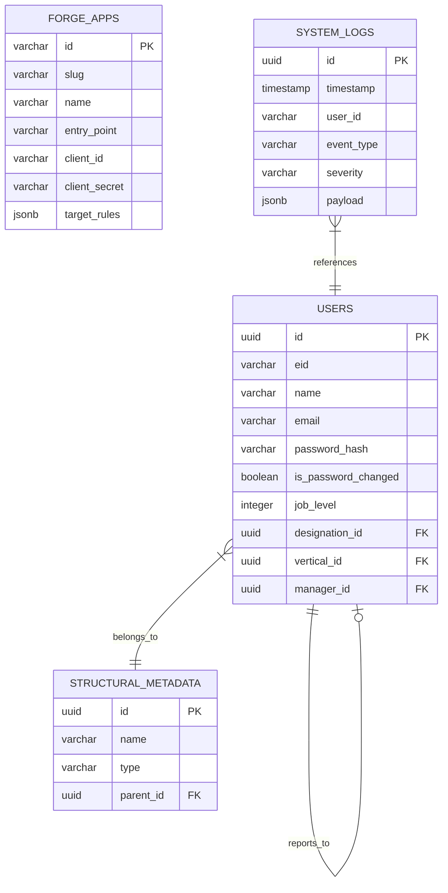

# System Architecture

This document details the design patterns, runtime models, database schema, and components that make up the SG Forge platform.

---

## 🏗 System Topology

SG Forge operates as a hybrid monolithic portal serving federated, isolated micro-applications:

---

## 🛠 Core Components

### 1. Next.js Portal Core (`core/`)
*   **Routing**: Next.js App Router for layouts, onboarding screens, administrative consoles, and dynamic iframe canvases.
*   **Auth Guard Middleware (`core/src/frontend/middleware.ts`)**: Intercepts unauthenticated routes, verifying JWT session cookies and enforcing mandatory password resets for new accounts.

### 2. App Engine Registry & Manifest Scanner
*   **App Configuration (`app.json`)**: Declares app slugs, descriptions, entry point URLs, target audience rules (verticals, designations, levels), and database preferences.
*   **Sync Pipeline (`core/src/backend/utils/manifestParser.ts`)**: Scans folders under `sandbox/apps/` on startup, registers new applications inside the `forge_apps` table, and automatically provisions unique Client IDs and Secrets.

### 3. Interactive Semantic Org Canvas
An infinite-grid workspace supporting zoom-dependent card rendering:
*   **Macro View (Zoom < 80%)**: Bento-Box layout displaying departmental summaries and total member counts.
*   **Meso View (80% - 140% Zoom)**: Employee clusters mapped to their managers via dynamic SVG paths.
*   **Micro View (Zoom >= 140%)**: Detailed profile cards showcasing EID, name, designation, and status indicators.

---

## 🗄 Database Schema Matrix

The database layer stores its structures in PostgreSQL, separated into four areas:

