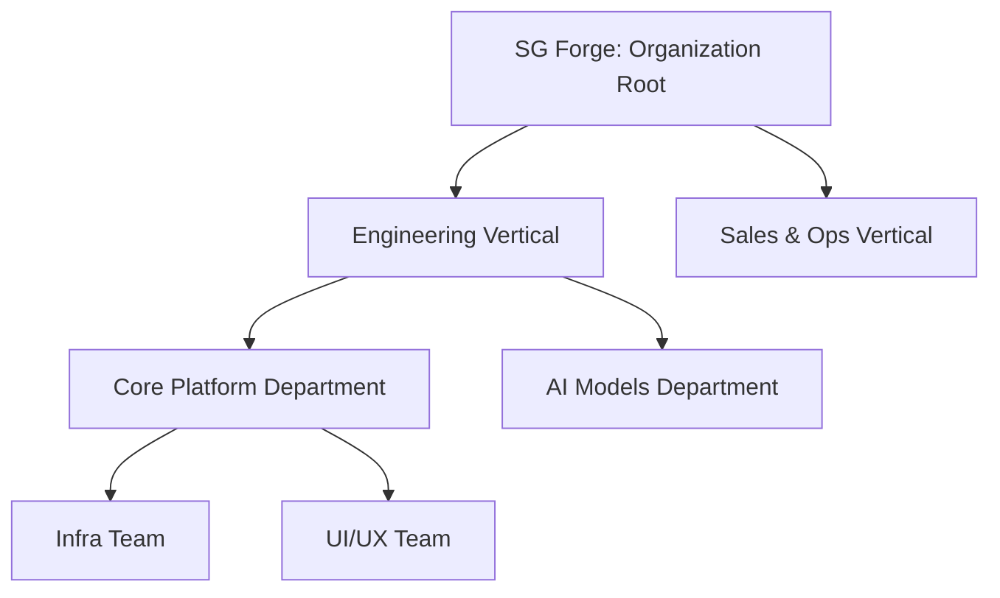
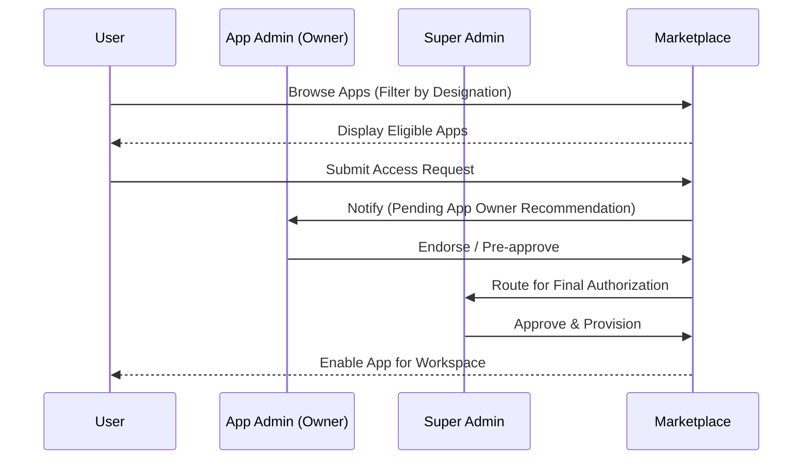

# SG Forge: Enterprise Org Hierarchy, Matrix Projects & App Access Marketplace
## Technical Architecture Blueprint

This document details the end-to-end technical architecture and database schemas required to implement a flexible, high-performance, and generic organization hierarchy, matrix project grouping, granular app entitlements, and a marketplace access request workflow.

---

## 1. Architectural Philosophy & Principles
To build a system that scales to any complexity while remaining simple to operate, we adhere to the following principles:
* **Relational Power**: Leverage PostgreSQL's native JSONB, indexing, and recursive Common Table Expression (CTE) capabilities. Do not introduce graph databases or specialized permission stores (like Zanzibar-style engines) until the organization exceeds $100,000$ active users.
* **Deny-Overrides-Grant**: Any explicit access restriction overrides positive entitlement grants.
* **Separation of Dimensions**: Reporting lines (vertical hierarchy) and project-based groups (horizontal matrix) are distinct dimensions that must never be merged into a single table.
* **OAuth-First App Boundaries**: Sandboxed apps (in iframes) only read hierarchy metadata via REST APIs secured by cryptographically signed, scope-limited JWTs.

---

## 2. Phase 1: The Unified Org Node Hierarchy (Vertical Dimension)

### The Problem with Rigid Tables
Creating separate tables for `divisions`, `departments`, `sub_departments`, and `teams` is an anti-pattern. Different enterprises use different naming structures and hierarchies (e.g., *Division $\rightarrow$ Department $\rightarrow$ Team* vs. *Region $\rightarrow$ Plant $\rightarrow$ Cost Center $\rightarrow$ Pod*). A fixed schema structure will inevitably break.

### The Architect's Solution: Unified Org Nodes
We model the entire vertical hierarchy using a single self-referencing table with dynamic node types.



### Database Schema
```sql
-- 1. Allowed Node Types Definition Matrix (Controlled Vocabulary)
CREATE TABLE org_node_types (
    id UUID PRIMARY KEY DEFAULT gen_random_uuid(),
    name VARCHAR(50) UNIQUE NOT NULL, -- e.g., 'company', 'division', 'department', 'team', 'pod'
    sort_order INT NOT NULL DEFAULT 0
);

-- 2. Unified Organizational Nodes
CREATE TABLE org_nodes (
    id UUID PRIMARY KEY DEFAULT gen_random_uuid(),
    node_type_id UUID NOT NULL REFERENCES org_node_types(id),
    name VARCHAR(255) NOT NULL,
    parent_id UUID REFERENCES org_nodes(id) ON DELETE RESTRICT, -- Prevent deletion of parent if children exist
    metadata JSONB DEFAULT '{}'::jsonb NOT NULL, -- Custom attributes (e.g., cost_center, location)
    created_at TIMESTAMP DEFAULT NOW() NOT NULL,
    updated_at TIMESTAMP DEFAULT NOW() NOT NULL
);

-- Add an index on parent_id for fast recursive queries
CREATE INDEX idx_org_nodes_parent ON org_nodes(parent_id);

-- 3. Polymorphic User Memberships
CREATE TABLE user_org_nodes (
    id UUID PRIMARY KEY DEFAULT gen_random_uuid(),
    user_id UUID NOT NULL REFERENCES users(id) ON DELETE CASCADE,
    org_node_id UUID NOT NULL REFERENCES org_nodes(id) ON DELETE CASCADE,
    relationship VARCHAR(50) DEFAULT 'member' NOT NULL, -- 'member' | 'lead' | 'manager'
    is_primary BOOLEAN DEFAULT true NOT NULL, -- A user can belong to multiple nodes but has one primary department/team
    created_at TIMESTAMP DEFAULT NOW() NOT NULL,
    UNIQUE(user_id, org_node_id)
);
```

### Resolving Hierarchy with Recursive CTEs
To check a user's upline (ancestors) or downline (descendants) in PostgreSQL:
```sql
-- Fetch all parent nodes (lineage) of a specific Org Node (e.g., 'Team 1')
WITH RECURSIVE org_lineage AS (
    SELECT id, name, parent_id, node_type_id 
    FROM org_nodes 
    WHERE id = :target_node_id
    
    UNION ALL
    
    SELECT parent.id, parent.name, parent.parent_id, parent.node_type_id
    FROM org_nodes parent
    INNER JOIN org_lineage child ON child.parent_id = parent.id
)
SELECT * FROM org_lineage;
```

---

## 3. Phase 2: Projects as a Second Dimension (Horizontal Matrix)

### Line Managers vs. Project Owners
* **Line Managers** are aligned with the vertical hierarchy (`org_nodes`). They manage headcount, salary, and career growth.
* **Project Owners** manage deliverables. Individual contributors from *different* teams (e.g., an Engineer from the *Infra Team* and an Analyst from the *Finance Team*) collaborate on a *Project*.

```
Vertical hierarchy (org_nodes)       Horizontal Matrix (projects)
==============================       ============================
[Engineering Vertical]               [Project Delta]
  └── [Infra Team]                      ├── User A (Infra)
        └── User A  ────────────────────┤
  └── [UI/UX Team]                      │
        └── User B                      │
[Finance Vertical]                      │
  └── [Finance Team]                    │
        └── User C  ────────────────────┘
```

### Database Schema
```sql
-- 1. Project Registry Ledger
CREATE TABLE projects (
    id UUID PRIMARY KEY DEFAULT gen_random_uuid(),
    name VARCHAR(255) NOT NULL,
    code VARCHAR(100) UNIQUE NOT NULL, -- e.g., 'PROJ-DELTA'
    description TEXT,
    owner_id UUID NOT NULL REFERENCES users(id), -- Project Manager / Sponsor
    status VARCHAR(30) DEFAULT 'active' NOT NULL, -- 'planning' | 'active' | 'completed' | 'paused'
    start_date DATE,
    end_date DATE,
    created_at TIMESTAMP DEFAULT NOW() NOT NULL,
    updated_at TIMESTAMP DEFAULT NOW() NOT NULL
);

-- 2. Project Members Junction Table
CREATE TABLE project_members (
    id UUID PRIMARY KEY DEFAULT gen_random_uuid(),
    project_id UUID NOT NULL REFERENCES projects(id) ON DELETE CASCADE,
    user_id UUID NOT NULL REFERENCES users(id) ON DELETE CASCADE,
    role VARCHAR(100) DEFAULT 'contributor' NOT NULL, -- 'lead' | 'contributor' | 'observer'
    allocation_percent INT DEFAULT 100 NOT NULL, -- Supporting matrix allocations (e.g. 50% allocation)
    joined_at TIMESTAMP DEFAULT NOW() NOT NULL,
    UNIQUE(project_id, user_id)
);
```

---

## 4. Phase 3: Forge App Granular Entitlements Engine

### Access Rule Types
To provide absolute freedom, we support access configuration targeting:
1. A single user (`user`)
2. Multiple selected users (multiple `user` rules)
3. A team / node in the hierarchy (`org_node`)
4. A project (`project`)
5. A dynamic group (`group`)
6. Designation-level rules (e.g., only L5 and above)

### Database Schema
```sql
CREATE TABLE forge_app_entitlements (
    id UUID PRIMARY KEY DEFAULT gen_random_uuid(),
    app_id UUID NOT NULL REFERENCES forge_apps(id) ON DELETE CASCADE,
    subject_type VARCHAR(50) NOT NULL, -- 'user' | 'org_node' | 'project' | 'group' | 'designation'
    subject_id UUID NOT NULL, -- Points to the ID of the respective table
    access_type VARCHAR(10) NOT NULL DEFAULT 'grant', -- 'grant' | 'deny'
    granted_by UUID REFERENCES users(id) ON DELETE SET NULL,
    created_at TIMESTAMP DEFAULT NOW() NOT NULL
);

-- Indexing for fast access verification
CREATE INDEX idx_entitlements_lookup ON forge_app_entitlements (app_id, subject_type, subject_id);
```

### Access Resolution Query (Deny-Overrides-Grant Logic)
To determine if a user has access to a specific application, we must collect all matching rules and apply the rule that **Explicit Deny overrides any Grant**.

```sql
WITH user_context AS (
    -- Collect all active memberships of the target user
    SELECT 
        u.id AS user_id,
        u.designation_id AS designation_id,
        ARRAY_AGG(DISTINCT ut.team_id) FILTER (WHERE ut.team_id IS NOT NULL) AS team_ids,
        ARRAY_AGG(DISTINCT pm.project_id) FILTER (WHERE pm.project_id IS NOT NULL) AS project_ids,
        ARRAY_AGG(DISTINCT ug.group_id) FILTER (WHERE ug.group_id IS NOT NULL) AS group_ids
    FROM users u
    LEFT JOIN user_teams ut ON ut.user_id = u.id
    LEFT JOIN project_members pm ON pm.user_id = u.id
    LEFT JOIN user_groups ug ON ug.user_id = u.id
    WHERE u.id = :target_user_id
    GROUP BY u.id, u.designation_id
),
matching_policies AS (
    SELECT e.access_type
    FROM forge_app_entitlements e
    CROSS JOIN user_context uc
    WHERE e.app_id = :target_app_id
      AND (
        (e.subject_type = 'user' AND e.subject_id = uc.user_id)
        OR (e.subject_type = 'org_node' AND e.subject_id = ANY(uc.team_ids))
        OR (e.subject_type = 'project' AND e.subject_id = ANY(uc.project_ids))
        OR (e.subject_type = 'group' AND e.subject_id = ANY(uc.group_ids))
        OR (e.subject_type = 'designation' AND e.subject_id = uc.designation_id)
      )
)
SELECT 
    CASE 
        WHEN 'deny' = ANY(SELECT access_type FROM matching_policies) THEN false
        WHEN 'grant' = ANY(SELECT access_type FROM matching_policies) THEN true
        ELSE false -- Default Closed (No explicit grant means no access)
    END AS has_access;
```

---

## 5. Phase 4: Hierarchy Access API for Forge Apps

### Security Boundary: Scope Constraints
Forge Apps must never execute raw database queries against core tables. Instead, apps query the API Gateway using their OAuth `accessToken`. We introduce specific hierarchy scopes:
* `org.nodes.read`: View the hierarchy tree structures.
* `org.users.read`: Query profiles, designations, and managers.
* `org.projects.read`: Fetch project membership.

### REST Endpoints
The Platform Core exposes endpoints tailored for hierarchical logic:

#### 1. Retrieve Current User Context
* `GET /api/v1/org/context`
* Returns the requester's structural metadata, managers, team memberships, and active projects.
* **Response Payload:**
  ```json
  {
    "userId": "9b1deb4d-3b7d-4bad-9bdd-2b0d7b3dcb6d",
    "name": "Jane Doe",
    "designation": {
      "id": "20000000-0000-0000-0000-000000000005",
      "name": "L6 Engineering Manager",
      "level": 6
    },
    "managerId": "481a5a04-5178-43d9-95ab-dc3d82a6136e",
    "primaryOrgNode": {
      "id": "c1619623-64a8-4444-8461-840a3f9e9cf2",
      "name": "Core Engine",
      "type": "team"
    },
    "teams": ["Core Engine", "AI Task Force"],
    "projects": ["PROJ-DELTA"],
    "isManagement": true
  }
  ```

#### 2. Verify Reporting Relationship (Is Manager Check)
* `GET /api/v1/org/hierarchy/verify-relationship?employee_id=X&manager_id=Y`
* Solves checking if manager $Y$ is in the direct reporting path above employee $X$ (handles multi-level hierarchy via recursive query).
* **Response Payload:**
  ```json
  {
    "isDirectReport": false,
    "isIndirectReport": true,
    "reportingDistance": 2
  }
  ```

---

## 6. Phase 5: Marketplace Discoverability & Access Approval Workflow



### 1. Designation-Based App Filter
The marketplace API endpoint `/api/v1/marketplace/apps` returns apps visible to the user.
* In the app registry, we use `target_rules` containing visibility parameters:
  ```json
  {
    "visible_designation_levels": [5, 6, 7, 8, 10, 12]
  }
  ```
* The query filters apps where the user's designation level is listed or if no visibility rule exists (public).

### 2. Database Schema for Access Requests
To prevent administrative bottlenecks, we establish **App Admins** (app developers or line business owners who manage access requests) and **Super Admins** (who retain final security authority).

```sql
-- 1. App Admins (Owners of a specific App)
CREATE TABLE forge_app_admins (
    id UUID PRIMARY KEY DEFAULT gen_random_uuid(),
    app_id UUID NOT NULL REFERENCES forge_apps(id) ON DELETE CASCADE,
    user_id UUID NOT NULL REFERENCES users(id) ON DELETE CASCADE,
    created_at TIMESTAMP DEFAULT NOW() NOT NULL,
    UNIQUE(app_id, user_id)
);

-- 2. Access Request Records
CREATE TABLE forge_app_access_requests (
    id UUID PRIMARY KEY DEFAULT gen_random_uuid(),
    app_id UUID NOT NULL REFERENCES forge_apps(id) ON DELETE CASCADE,
    requester_id UUID NOT NULL REFERENCES users(id) ON DELETE CASCADE,
    reason TEXT NOT NULL,
    scope VARCHAR(30) NOT NULL DEFAULT 'individual', -- 'individual' | 'org_node' | 'project'
    target_entity_id UUID, -- NULL for individual, org_node_id if team request, project_id if project request
    
    status VARCHAR(30) NOT NULL DEFAULT 'pending_app_admin', 
    -- 'pending_app_admin' | 'pending_super_admin' | 'approved' | 'rejected'
    
    app_admin_reviewed_by UUID REFERENCES users(id),
    app_admin_notes TEXT,
    
    super_admin_reviewed_by UUID REFERENCES users(id),
    super_admin_notes TEXT,
    
    created_at TIMESTAMP DEFAULT NOW() NOT NULL,
    updated_at TIMESTAMP DEFAULT NOW() NOT NULL
);
```

### 3. Provisioning Trigger (Transaction Guarantee)
When a Super Admin approves a request (`status = 'approved'`), the system must run a transaction that writes to both tables to prevent drift:
```sql
BEGIN;

UPDATE forge_app_access_requests
SET status = 'approved',
    super_admin_reviewed_by = :super_admin_id,
    updated_at = NOW()
WHERE id = :request_id;

-- Insert matching rule into the entitlements table
INSERT INTO forge_app_entitlements (app_id, subject_type, subject_id, access_type, granted_by)
SELECT 
    app_id, 
    CASE 
        WHEN scope = 'individual' THEN 'user'
        WHEN scope = 'org_node' THEN 'org_node'
        WHEN scope = 'project' THEN 'project'
    END,
    COALESCE(target_entity_id, requester_id),
    'grant',
    :super_admin_id
FROM forge_app_access_requests
WHERE id = :request_id;

COMMIT;
```

---

## 7. Architect's Honest Trade-offs & Recommendations

### 1. Alternative: Zanzibar ReBAC (Relation-Based Access Control)
* **What it is**: Modeling access as a graph of tuples `(object:app_1, relation:viewer, subject:user_1)`.
* **Honest Opinion**: Overkill. Writing a Zanzibar clone in NodeJS/Typescript introduces immense latency and indexing overhead. A recursive CTE query against PostgreSQL `org_nodes` completes in $<5\text{ms}$ up to 50,000 records. Keep it relational.

### 2. Alternative: Separate Tables for Teams/Groups/Projects vs. Polymorphic Nodes
* **Our Recommendation**: Keep `projects` separate because its data lifecycle and relationships are horizontal and matrix-based (has start/end dates, allocation percentages, cross-functional). Keep `groups` separate since they are dynamic collections of users (e.g. email lists, temporary distribution groups). Use a unified table (`org_nodes`) *only* for the structural vertical reporting lines of the company.

### 3. Edge-Case: Circular Reporting Prevention
* **Risk**: A user sets their manager as User B, and User B sets their manager as User A, causing infinite loops in recursive CTE queries.
* **Mitigation**: Add a Postgres database trigger on insert/update of the `users.manager_id` or `org_nodes.parent_id` to verify that the parent is not a descendant of the child.
```sql
CREATE OR REPLACE FUNCTION check_circular_manager()
RETURNS TRIGGER AS $$
BEGIN
    IF NEW.manager_id IS NOT NULL THEN
        -- Check if the new manager has the current user in their reporting chain
        IF EXISTS (
            WITH RECURSIVE reporting_chain AS (
                SELECT id, manager_id FROM users WHERE id = NEW.manager_id
                UNION ALL
                SELECT u.id, u.manager_id 
                FROM users u
                INNER JOIN reporting_chain rc ON rc.manager_id = u.id
            )
            SELECT 1 FROM reporting_chain WHERE id = NEW.id
        ) THEN
            RAISE EXCEPTION 'Circular reporting loop detected: User cannot report directly or indirectly to their subordinate.';
        END IF;
    END IF;
    RETURN NEW;
END;
$$ LANGUAGE plpgsql;

CREATE TRIGGER trigger_prevent_circular_reporting
BEFORE INSERT OR UPDATE ON users
FOR EACH ROW EXECUTE FUNCTION check_circular_manager();
```

---

## 8. Delegated Administration & Authority Mapping

### 1. Creation and Management of Teams (The Authority Split)
* **Super Admin (Platform Scope)**: Retains global platform governance. They are the only ones who can configure system-wide authentication (e.g. SSO), register/deregister new Forge Apps in the global marketplace, assign base roles (`admin`, `read_only_admin`, `super_admin`), and audit system logs.
* **Org Admin (Resource Scope)**: Handles the day-to-day organizational topology. They determine *how many teams* exist. Admins can create, delete, or rename organizational units (`org_nodes`), change hierarchical parent links, and designate initial "Team Managers".

### 2. Delegated Team Managers
To prevent admins from becoming bottlenecks, management of specific teams is delegated directly to employees:
1. An **Admin** assigns one or more employees as the "Manager" or "Lead" of an `org_node` (by setting their relationship to `'manager'` or `'lead'` in `user_org_nodes`).
2. These delegated users (who remain standard `users` globally) are granted write permissions *exclusively* for their team node and its immediate children.
3. Delegated Managers can search the user directory to **add members** or **remove members** from their assigned team.

* **API Authorization Guard**:
  When managing members for a team (`POST /api/v1/org/nodes/:nodeId/members`), the API verifies permissions dynamically:
  ```typescript
  async function checkNodeManager(requesterId: string, nodeId: string): Promise<boolean> {
    // 1. Bypass check if the user is a global Admin or Super Admin
    const globalRole = await getUserGlobalRole(requesterId);
    if (globalRole === 'super_admin' || globalRole === 'admin') return true;

    // 2. Check if the user is a manager/lead of this node or its parent nodes (recursive)
    const isManager = await db.execute(sql`
      WITH RECURSIVE node_lineage AS (
        SELECT id, parent_id FROM org_nodes WHERE id = ${nodeId}
        UNION ALL
        SELECT parent.id, parent.parent_id
        FROM org_nodes parent
        INNER JOIN node_lineage child ON child.parent_id = parent.id
      )
      SELECT 1 FROM user_org_nodes uon
      INNER JOIN node_lineage nl ON uon.org_node_id = nl.id
      WHERE uon.user_id = ${requesterId}
        AND uon.relationship IN ('manager', 'lead')
      LIMIT 1;
    `);

    return isManager.rows.length > 0;
  }
  ```

---

## 9. UI/UX Experience Matrix: Admin vs. User Views

Below is the interface structure and functional breakdown across different system viewpoints.

### 1. Global Admin Dashboard View (Super Admin / Admin)
* **Org Structure Tree Builder Canvas**:
  * An interactive visual canvas displaying all Nodes (Divisions, Departments, Teams, Pods).
  * Direct node editing: add a child team, rename a department, or drag-and-drop to adjust parent links (running circularity checks in the background).
  * Quick-search bar to assign "Team Managers" to any node.
* **App Catalog Registry Manager**:
  * Form to register a new Forge App (entering name, entry URL, developer details, client secret).
  * *Targeting Rules Modal*: UI to configure designation eligibility rules (e.g. "Visible only to L6+ designations").
* **Global Access Requests Queue**:
  * A table listing all pending employee access requests: `Requester | Requested App | Target (Self/Team/Project) | Reason | Actions (Approve / Reject)`.
  * Multi-select bulk approval capability for quick management.

### 2. Team Lead / Manager Console View
* **"My Managed Teams" Tab**:
  * A dedicated dashboard that appears only for users who are assigned as managers of one or more `org_nodes`.
  * Displays a team roster with details (Job Title, Reporting Path).
  * *Roster Management Buttons*:
    * **Add Member**: Opens a modal with a directory search (de-duplicated against current members).
    * **Remove Member**: Triggering an instant removal flow with confirmation.
* **Team App Management Modal**:
  * Displays apps enabled for their team.
  * Allows the Team Lead to request access for a new app on behalf of the *entire team* (e.g. requesting a PM tool for all engineers).

### 3. Standard Employee (User) View
* **Personal Profile & Directory Roster**:
  * A structured profile displaying their vertical alignment: Manager, Peers, Team Roster, and any assigned Matrix Projects.
* **The App Marketplace Screen**:
  * Displays apps in cards, categorized by access state:
    * **Enabled Apps**: Apps the user has active access to (displays "Open App" button).
    * **Requestable Apps**: Apps the user is eligible for based on their designation (displays "Request Access" button).
    * **Unavailable Apps**: Apps with targeting rules that block the user (hidden or greyed out).
  * **Access Request Modal**:
    * Triggered by clicking "Request Access".
    * User types a brief justification/reason.
    * Selects request scope: `Individual` (just for them) or `Project` (if they are a project owner).
  * **"My Access Requests" Dashboard**:
    * Lists historical and pending requests with statuses: `Pending Admin Approval`, `Approved` (with launch link), or `Rejected` (with administrative feedback notes).

