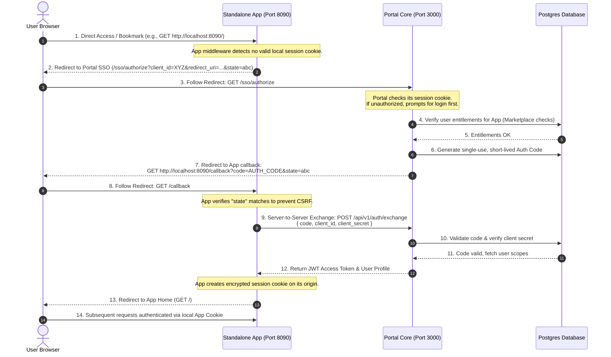

# SG Forge: Independent Tab Execution & Federated Web SSO Architecture
## Technical Proposal & Security Analysis

This document outlines the architecture, flow mechanics, security posture, and developer experience (DX) required to enable isolated Forge Apps to run in standalone browser tabs, while remaining securely bound to the parent platform's identity, permission control, and API gateway.

---

## 1. Executive Evaluation

### The Verdict: Highly Feasible and Recommended
Allowing applications to run in their own tabs instead of strictly within iframes is an **industry-standard enterprise requirement**. Relying solely on iframes creates significant user experience (UX) friction and operational limitations:
* **UX Bottlenecks:** Users cannot bookmark specific tools, use native browser back/forward buttons cleanly, or utilize screen space effectively.
* **Tech Limitations:** Complex Web API integrations (e.g., screen sharing, device input, clipboard, downloads, large local storage) are often restricted or disabled inside iframe sandbox boundaries.
* **Scaling:** An iframe monolith canvas requires the parent window to stay alive, which increases DOM bloat and RAM consumption.

By shifting from strict iframe routing to **Federated Web SSO (Single Sign-On)**, the platform shifts from a basic "micro-frontend wrapper" to a true **Federated Enterprise Ecosystem** (acting as the Identity Provider, or IdP) and treating micro-apps as separate Service Providers (SPs).

---

## 2. Core Architectural Challenge: The Browser Sandbox

Because isolated Forge Apps run on different ports (e.g., `:8090` vs. core on `:3000`) or distinct subdomains (e.g., `expenses.forge.local` vs. `core.forge.local`):
1. **Cookie Partitioning:** The parent browser cookies (stored under `localhost:3000` or `core.forge.local`) cannot be read by the child app because of the **Same-Origin Policy (SOP)**.
2. **SameSite Lax/Strict Rules:** Even if subdomains are shared, modern browsers restrict third-party cookie sending to mitigate CSRF, blocking direct session inheritance.
3. **Storage Partitioning:** LocalStorage and IndexedDB are strictly partitioned per origin.

**Solution:** We must implement a standard **SSO Handshake Redirect Protocol** (modeled after OAuth 2.0 / OpenID Connect Authorization Code Flow with PKCE).

---

## 3. The Federated SSO Handshake Protocol



### Detailed Flow Steps
1. **Direct Access Detection:** The user requests `http://localhost:8090/`. The app's web framework middleware looks for a local session cookie (e.g., `forge_session`).
2. **SSO Redirection:** Finding no session, the app redirects the browser to the portal's SSO endpoint:
   `https://portal.company.com/sso/authorize?client_id=APP_CLIENT_ID&redirect_uri=https://app.company.local/callback&state=RANDOM_CSRF_TOKEN`
3. **Portal Authentication & Authorization:**
   * The portal authenticates the user (via standard portal session cookies). If not logged in, user completes portal login.
   * The portal resolves the user's entitlements (checking the `forge_app_entitlements` table) to verify they have access to the app. If not, it returns `403 Forbidden`.
4. **Code Generation:** If authorized, the portal generates a cryptographically random, single-use **Authorization Code** (`auth_code_...`), saves it in the database with a 30-second expiry, and redirects the browser back:
   `https://app.company.local/callback?code=AUTH_CODE&state=RANDOM_CSRF_TOKEN`
5. **Token Exchange (Back-Channel):**
   * The app backend receives the request on `/callback`, validates that the query parameter `state` matches the one originally set in the user's temporary cookie (preventing CSRF).
   * The app makes a server-to-server HTTP request to the portal:
     `POST https://portal.company.com/api/v1/auth/exchange`
     Payload: `{ code: "AUTH_CODE", client_id: "APP_CLIENT_ID", client_secret: "APP_CLIENT_SECRET" }`
   * The portal validates the code, marks it as used, signs an access token (JWT) containing the user’s identity and scopes, and returns it.
6. **Local Session Establishment:** The app backend sets an encrypted, `HttpOnly`, `Secure`, `SameSite=Lax` cookie containing the JWT on its own origin, then redirects the user to the app root page.

---

## 4. Security Threat Modeling & Mitigations

An independent tab environment exposes more attack vectors than a sandboxed iframe. Below is the threat matrix and architectural mitigations:

| Threat Vector | Exploit Scenario | Platform & SDK Mitigation Strategy |
| :--- | :--- | :--- |
| **Auth Code Interception & Reuse** | An attacker steals an auth code from browser history or HTTP logs and attempts to exchange it. | 1. **Short Lifespan:** Codes must expire in $\le 30$ seconds.<br/>2. **Single Use:** If an auth code is requested twice, the portal immediately invalidates all access tokens issued for that client.<br/>3. **Exact Redirect URI Matching:** Portal enforces strict whitelist verification of the `redirect_uri` against the app registration record. |
| **Cross-Site Request Forgery (CSRF)** | An attacker tricks a victim's browser into authorizing an app, attaching the attacker's session. | Enforce the `state` parameter in the authorize redirect. The SDK must automatically generate, sign, verify, and clean up the state token stored in a client-side session cookie. |
| **Token Interception (Man-in-the-Middle)** | Network eavesdropping on public networks steals access tokens. | **Enforced TLS:** All redirects and token exchanges must utilize HTTPS. Core API routes will refuse connections from apps using plain HTTP (outside `localhost` dev environments). |
| **Open Redirect Vulnerability** | An attacker uses the portal's authorize page to redirect users to a malicious site (e.g., `?redirect_uri=https://malicious.com`). | The portal core MUST reject authorization requests if the requested `redirect_uri` is not explicitly whitelisted in the app’s `app.json` configuration. |
| **Single Logout (SLO) Desynchronization** | A user logs out of the main portal core, but remains authenticated inside the app's standalone tab. | 1. **Short Access Token Lifespan:** Set JWT expiry to 1 hour, prompting the app to request refresh/re-check.<br/>2. **Backchannel Logout:** The portal publishes a logout webhook to all active apps when the user triggers a sign-out.<br/>3. **Iframe Ping Mechanism:** Optional fallback where the app queries `/api/v1/auth/session` in the background. |

---

## 5. Developer Experience (DX): Standard Settings & Auto-Handling

The app developer should **never** write OAuth code, redirect controllers, or session crypto manually. The entire flow should be managed dynamically by the registry config and the **Forge SDK**.

### 1. Configuration in `app.json`
The developer simply updates the manifest to declare standalone capabilities:

```json
{
  "id": "nexus-provisioning",
  "slug": "nexus-provisioning",
  "version": "1.0.0",
  "routingMode": "standalone",
  "entryPoint": "http://nexus-provisioning:8090/",
  "sandboxEntryPoint": "http://localhost:8090/",
  "clientId": "client_nexus_provisioning",
  "clientSecret": "secret_nexus_provisioning",
  "sso": {
    "enabled": true,
    "redirectUris": [
      "http://localhost:8090/callback",
      "http://nexus-provisioning:8090/callback"
    ]
  }
}
```

### 2. Zero-Overhead SDK Integration
The Forge SDK handles redirect initiation, cookie management, callback execution, and API token refresh under the hood.

#### Next.js App Router Integration
The developer just updates their middleware to guard all routes:

```typescript
// src/middleware.ts
import { forgeAuthMiddleware } from '@sg-forge/sdk-next';

export default forgeAuthMiddleware({
  clientId: process.env.FORGE_CLIENT_ID!,
  clientSecret: process.env.FORGE_CLIENT_SECRET!,
  portalUrl: process.env.FORGE_PORTAL_URL!, // e.g. http://localhost:3000
  callbackPath: '/callback',
});

export const config = {
  matcher: ['/((?!api/public|_next/static|_next/image|favicon.ico).*)'],
};
```

#### Python FastAPI / Flask Integration
For Python apps, a single middleware initialization handles the security headers, token verification, and redirect loops:

```python
from fastapi import FastAPI
from forge_sdk.fastapi import ForgeSSOMiddleware

app = FastAPI()

app.add_middleware(
    ForgeSSOMiddleware,
    client_id="client_nexus_provisioning",
    client_secret="secret_nexus_provisioning",
    portal_url="http://localhost:3000",
    redirect_uri="http://localhost:8090/callback",
    session_cookie_name="forge_session"
)

@app.get("/")
def home(request):
    # The middleware automatically attaches the authenticated user profile
    user = request.state.user
    return {"message": f"Hello {user.name}!"}
```

---

## 6. Proposed Database & API Schema Modifications

To support this federated architecture, the platform core requires minimal database extensions:

### 1. Database Migrations
We extend the `forge_apps` table to support multiple redirect URIs:

```sql
-- Add sso_redirect_uris to allow multiple oauth callback locations
ALTER TABLE forge_apps ADD COLUMN sso_redirect_uris JSONB DEFAULT '[]'::jsonb NOT NULL;
```

### 2. The SSO Authorization Endpoint (`GET /api/v1/auth/authorize`)
This new public API route processes direct incoming login redirects:

* **Request Parameters:**
  * `client_id` (string): The application client ID.
  * `redirect_uri` (string): The endpoint callback.
  * `state` (string): Random CSRF security parameter.
  * `response_type` (string): Must be `'code'`.

* **Logic Implementation:**
  ```typescript
  // src/frontend/app/api/v1/auth/authorize/route.ts
  import { NextRequest, NextResponse } from 'next/server';
  import { getSession } from '@backend/auth/sessionManager';
  import { db } from '@database/connection';
  import { sql } from 'drizzle-orm';
  import crypto from 'crypto';

  export async function GET(request: NextRequest) {
    const { searchParams } = new URL(request.url);
    const clientId = searchParams.get('client_id');
    const redirectUri = searchParams.get('redirect_uri');
    const state = searchParams.get('state');
    const responseType = searchParams.get('response_type');

    if (!clientId || !redirectUri || !state || responseType !== 'code') {
      return new NextResponse('Invalid authorization request parameters', { status: 400 });
    }

    // 1. Fetch app config
    const appResult = await db.execute(sql`
      SELECT id, is_enabled, sso_redirect_uris FROM forge_apps WHERE client_id = ${clientId}
    `);
    const app = appResult.rows?.[0] as any;
    if (!app || !app.is_enabled) {
      return new NextResponse('Application not found or disabled', { status: 404 });
    }

    // 2. Validate redirect_uri is whitelisted
    const whitelisted = JSON.parse(app.sso_redirect_uris || '[]');
    if (!whitelisted.includes(redirectUri)) {
      return new NextResponse('Unauthorized redirect URI', { status: 400 });
    }

    // 3. Check portal session
    const session = await getSession(request);
    if (!session) {
      // Redirect to login page and preserve auth request context in parameter
      const loginUrl = new URL('/login', request.url);
      loginUrl.searchParams.set('redirect_back', request.url);
      return NextResponse.redirect(loginUrl);
    }

    // 4. Generate Auth Code
    const code = 'auth_code_' + crypto.randomBytes(16).toString('hex');
    const expiresAt = new Date(Date.now() + 30 * 1000); // 30 seconds limit

    await db.execute(sql`
      INSERT INTO forge_auth_codes (code, app_id, user_id, expires_at, scope)
      VALUES (${code}, ${app.id}, ${session.id}, ${expiresAt.toISOString()}, ${JSON.stringify(app.scopes || [])}::jsonb)
    `);

    // 5. Redirect back to App Callback
    const redirectUrl = new URL(redirectUri);
    redirectUrl.searchParams.set('code', code);
    redirectUrl.searchParams.set('state', state);
    return NextResponse.redirect(redirectUrl);
  }
  ```

---

## 7. Migration & Rollout Strategy

To maintain backward compatibility during development, the migration proceeds in two steps:

1. **Step 1: Hybrid Mode (Compatibility)**
   * Keep `routingMode: "iframe"` as the default behavior.
   * If `routingMode: "standalone"` is set, the portal’s user dashboard renders a target `_blank` anchor button that triggers a direct browser window redirect (`window.open`), instead of rendering an inline iframe.
   
2. **Step 2: Dual Entry Support**
   * Apps can support **both** iframe embedding and standalone access.
   * If loaded inside an iframe, they rely on `postMessage` client handshake.
   * If loaded in a tab, they use the `SSO Redirect` server-to-server handshake.
   * The Forge SDK handles both paths automatically by checking `window.self !== window.top` to detect the context.
