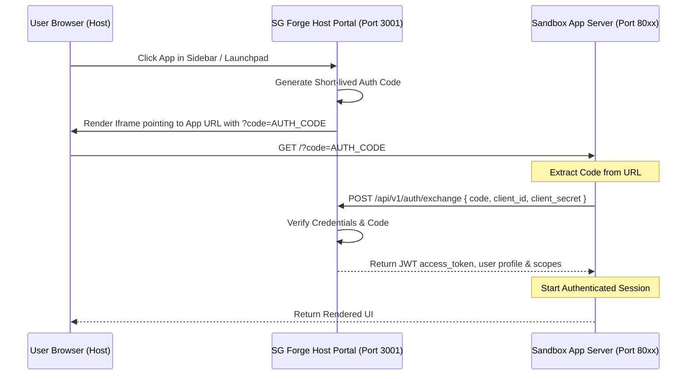

# Forge Application Integration Guide

This guide provides a comprehensive step-by-step walkthrough for building, connecting, and integrating sandboxed applications (Forge Apps) with the SG Forge Portal. It covers both **Internal (Plug-and-Play)** applications running inside the portal orchestration and **Externally Hosted** applications using our unified OAuth authentication platform.

---

## 🧭 1. Architecture Overview

Forge Applications are decoupled microservices running inside containerized or local sandbox environments. The host portal renders each app via an **iframe**, isolation is enforced through:
* **Zero-Trust Identity**: Apps do not share session cookies. Instead, they complete an OAuth-style code exchange for a short-lived JSON Web Token (JWT).
* **Database Isolation**: If configured, the platform automatically provisions a dedicated PostgreSQL database schema for the application, sandbox queries are restricted to this namespace.
* **Granular Entitlements**: Visibility and access can be restricted by user vertical (department), designation, or minimum job level.



---

## 📦 2. Application Types: Internal vs. Externally Hosted

Developers can integrate custom software into SG Forge via two different models:

### Model A: Internal Sandbox Applications (Plug-and-Play)
These are application servers written in any language, stored directly inside the repository workspace under `sandbox/apps/`.

* **Dynamic Discovery**: The portal scans `sandbox/apps/` subdirectories on startup. Simply placing your app folder there registers it.
* **Dynamic Background Spawning**: The dynamic runner (`scripts/dynamic-app-runner.ts`) automatically boots your app server (recognizing `server.ts`, `server.js`, `server.py`, `main.py`, or `main.go`) when you launch `./run.sh`.
* **Zero Host Port Exposure**: In Docker dev mode, the portal container acts as a reverse proxy. Any web requests to `/forge-apps/<app-slug>` are proxied to `http://localhost:<app-port>` *internally* within the container. **You do not need to expose your app's port in docker-compose.yaml**.

### Model B: Externally Hosted Applications (SSO Integration)
These are apps hosted on external servers (e.g. `https://custom-app.mycompany.com`) that participate in the SG Forge ecosystem.

* **Repository Footprint**: The developer only adds a folder containing an `app.json` manifest specifying the external `entryPoint`.
* **OAuth SSO Exchange**: The portal redirects or embeds the external URL, passing `?code=AUTH_CODE`. The external server makes a secure backend HTTPS request to the portal's public URL (`POST https://portal-domain.com/api/v1/auth/exchange`) to authenticate the user and fetch their profile.

---

## 🛠️ 3. Step-by-Step Integration Walkthrough

### Step 1: Create the Application Directory
Create a folder for your application inside `sandbox/apps/`:
```bash
mkdir -p sandbox/apps/my-custom-app
```

### Step 2: Add the Manifest File (`app.json`)
Every application requires a manifest at its root (`sandbox/apps/<slug>/app.json`). This tells the portal how to index, route, and permission your app.

Create `sandbox/apps/my-custom-app/app.json`:
```json
{
  "id": "app_custom_analytics_prod",
  "slug": "custom-analytics",
  "version": "1.0.0",
  "name": "Custom Analytics Dashboard",
  "description": "Enterprise performance analytics and database matrix monitors.",
  "icon": "TrendingUp",
  "roles": ["super_admin", "admin", "user"],
  "entryPoint": "http://localhost:8089",
  "routingMode": "iframe",
  "database": {
    "requiresIsolatedSchema": true,
    "schemaName": "forge_custom_analytics"
  },
  "targetRules": {
    "verticals": ["all"],
    "designations": [],
    "minJobLevel": 1
  }
}
```

> [!NOTE]
> * **For Internal Apps**: Set `entryPoint` to your local address (e.g. `http://localhost:8089`). The dynamic runner and proxy will resolve this.
> * **For External Apps**: Set `entryPoint` to the external URL (e.g. `https://custom-app.mycompany.com`).
> * **Manifest Validation**: Slugs must be entirely lowercase. Database schema names (`database.schemaName`) can contain only alphanumeric characters and underscores.

---

### Step 3: Implement Your App Server (Multi-Language Templates)

To prevent networking blockages in containerized or Windows environments, your server **must bind to `0.0.0.0`** instead of loopback interfaces (`127.0.0.1` or `localhost`).

Below are minimal, fully functional templates for Bun/TypeScript, Python, and Go:

#### Option A: Bun / TypeScript Server (`server.ts`)
```typescript
import { ForgeBackendClient } from '@packages/sdk';

const PORT = 8089;
const HOST = '0.0.0.0'; // Essential for container accessibility
const PORTAL_URL = process.env.PORTAL_URL || 'http://localhost:3001';

const sdk = new ForgeBackendClient({
  baseUrl: PORTAL_URL,
  clientId: 'client_id_from_db_or_manifest',
  clientSecret: 'client_secret_from_db_or_manifest'
});

const server = Bun.serve({
  port: PORT,
  hostname: HOST,
  async fetch(req) {
    const url = new URL(req.url);

    // 1. Health Probe Endpoint
    if (url.pathname === '/api/health') {
      return new Response(JSON.stringify({ status: 'active' }), {
        headers: { 'Content-Type': 'application/json' }
      });
    }

    // 2. Main Page Render
    if (url.pathname === '/' || url.pathname === '/web-ui') {
      const code = url.searchParams.get('code');
      let session = null;

      if (code) {
        try {
          // Perform backend handshake to obtain user session & JWT
          session = await sdk.exchangeCode(code);
        } catch (err) {
          console.error('Handshake failed:', err);
        }
      }

      return new Response(renderUI(session), {
        headers: { 'Content-Type': 'text/html' }
      });
    }

    return new Response('Not Found', { status: 404 });
  }
});

console.log(`🚀 Custom App running at http://${HOST}:${PORT}`);

function renderUI(session: any) {
  return `
    <!DOCTYPE html>
    <html>
    <head>
      <title>Analytics</title>
      <style>body { background: #0b0c10; color: #fff; font-family: sans-serif; padding: 20px; }</style>
    </head>
    <body>
      <h1>Custom Analytics Dashboard</h1>
      ${session ? `<p>Welcome, ${session.user.name} (${session.user.role})</p>` : `<p>Loading session...</p>`}
    </body>
    </html>
  `;
}
```

#### Option B: Python Server (`server.py`)
```python
import http.server
import socketserver
import json
import urllib.request
import urllib.parse
import os

PORT = 8089
HOST = "0.0.0.0" # Bind to all interfaces
PORTAL_URL = os.environ.get("PORTAL_URL", "http://localhost:3001")

class CustomAppHandler(http.server.BaseHTTPRequestHandler):
    def do_GET(self):
        parsed_url = urllib.parse.urlparse(self.path)
        
        # Health Check
        if parsed_url.path == "/api/health":
            self.send_response(200)
            self.send_header("Content-Type", "application/json")
            self.end_headers()
            self.wfile.write(json.dumps({"status": "active"}).encode("utf-8"))
            return

        # Main Page
        if parsed_url.path == "/" or parsed_url.path == "/web-ui":
            query_params = urllib.parse.parse_qs(parsed_url.query)
            code = query_params.get("code", [None])[0]
            user_name = "Guest"

            if code:
                # Exchange Code
                try:
                    url = f"{PORTAL_URL}/api/v1/auth/exchange"
                    payload = json.dumps({
                        "code": code,
                        "client_id": "app_custom_analytics_prod",
                        "client_secret": "my-client-secret"
                    }).encode("utf-8")
                    
                    req = urllib.request.Request(url, data=payload, headers={"Content-Type": "application/json"}, method="POST")
                    with urllib.request.urlopen(req, timeout=3) as resp:
                        res_data = json.loads(resp.read().decode("utf-8"))
                        user_name = res_data.get("user", {}).get("name", "User")
                except Exception as e:
                    print(f"Handshake failed: {e}")

            self.send_response(200)
            self.send_header("Content-Type", "text/html")
            self.end_headers()
            html = f"<html><body><h1>Python Sandbox App</h1><p>Hello, {user_name}</p></body></html>"
            self.wfile.write(html.encode("utf-8"))
            return

        self.send_error(404, "Not Found")

if __name__ == "__main__":
    with socketserver.TCPServer((HOST, PORT), CustomAppHandler) as httpd:
        print(f"Python Server listening on http://{HOST}:{PORT}")
        httpd.serve_forever()
```

#### Option C: Go Server (`main.go`)
```go
package main

import (
	"bytes"
	"encoding/json"
	"fmt"
	"net/http"
	"os"
)

const PORT = 8089
const HOST = "0.0.0.0"

var PortalURL = "http://localhost:3001"

func main() {
	if envUrl := os.Getenv("PORTAL_URL"); envUrl != "" {
		PortalURL = envUrl
	}

	http.HandleFunc("/api/health", func(w http.ResponseWriter, r *http.Request) {
		w.Header().Set("Content-Type", "application/json")
		json.NewEncoder(w).Encode(map[string]string{"status": "active"})
	})

	http.HandleFunc("/", func(w http.ResponseWriter, r *http.Request) {
		code := r.URL.Query().Get("code")
		userName := "Guest"

		if code != "" {
			payload, _ := json.Marshal(map[string]string{
				"code":          code,
				"client_id":     "app_custom_analytics_prod",
				"client_secret": "my-client-secret",
			})

			resp, err := http.Post(fmt.Sprintf("%s/api/v1/auth/exchange", PortalURL), "application/json", bytes.NewBuffer(payload))
			if err == nil {
				defer resp.Body.Close()
				var result map[string]interface{}
				json.NewDecoder(resp.Body).Decode(&result)
				if userMap, ok := result["user"].(map[string]interface{}); ok {
					userName = userMap["name"].(string)
				}
			}
		}

		w.Header().Set("Content-Type", "text/html")
		fmt.Fprintf(w, "<html><body><h1>Go Sandbox App</h1><p>Hello, %s</p></body></html>", userName)
	})

	addr := fmt.Sprintf("%s:%d", HOST, PORT)
	fmt.Printf("Go Server listening on http://%s\n", addr)
	http.ListenAndServe(addr, nil)
}
```

---

### Step 4: Add Frontend SDK Controls

To synchronize UI themes and reveal the iframe layout without jumps:

1. **Include the SDK Client**: Mount `@packages/sdk` on the client side.
2. **Listen to Host Events**: Connect callbacks to react when styling changes.
3. **Notify Host**: Trigger the `ready` signal so the host portal transitions from the loading state.

```javascript
import { ForgeClient } from '@packages/sdk';

const client = new ForgeClient();

// Sync styling to host portal
client.onThemeChange(({ theme }) => {
  document.documentElement.setAttribute('data-theme', theme);
  console.log(`Switched to theme: ${theme}`);
});

// Trigger host reveal
client.notifyReady();
```

---

## 🔒 4. Security & CORS for Externally Hosted Apps

If your application is hosted externally (`Model B`):
1. **CORS and Embedding Options**: If you are using `"routingMode": "iframe"`, the external app server must allow being embedded by the portal's domain name:
   - Ensure the server response does NOT send `X-Frame-Options: DENY`.
   - Set the appropriate Content Security Policy: `Content-Security-Policy: frame-ancestors 'self' https://your-portal-domain.com`.
2. **Alternative (Standalone Mode)**: If iframe restrictions prevent direct embedding, set `"routingMode": "standalone"` in `app.json`. The launchpad will perform a full-page redirect to authorize the user and return to your application callback.
3. **Secret Verification**: Keep your client secret secure and perform the `/auth/exchange` query ONLY server-side.

---

## 🧭 5. Troubleshooting & Diagnostics

| Issue | Typical Cause | Resolution |
| :--- | :--- | :--- |
| **App is stuck loading or shows spinning wheel** | The app frontend failed to execute `client.notifyReady()`. | Ensure you are calling `notifyReady()` in your client-side startup logic. |
| **Connection Refused inside container / sidebar** | The app server is binding to `127.0.0.1`. | Change the server binding option to `0.0.0.0` (all network interfaces). |
| **App doesn't show in launchpad directory** | The manifest schema validation failed, or the slug is misaligned. | Check the server logs on startup. Keep your slug lowercase and remove dashes in `schemaName`. |
| **Auth Exchange fails with certificate error** | Secure SSL mismatch during HTTPS backchannel exchange. | Set up trusted root CA certificates on your external server or disable local SSL checks in non-prod. |
