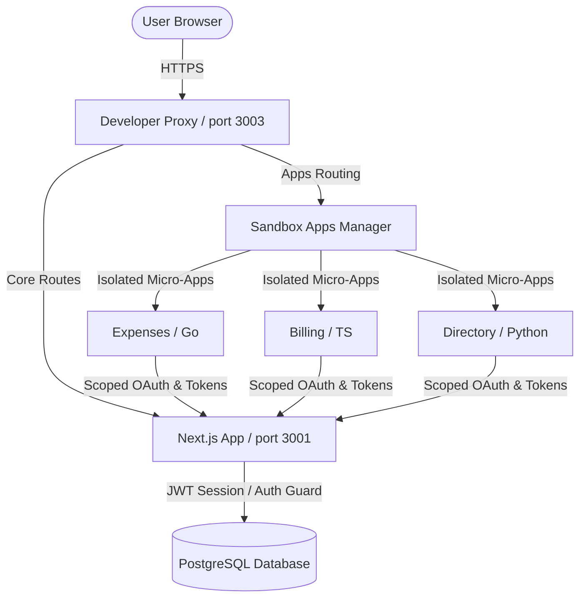

# Introduction

## What is SG Forge?

**SG Forge Portal** is a high-performance, plug-and-play organizational workspace engine designed to replace static directories with a zoomable semantic workspace (Org Canvas) featuring real-time visual mapping, standardized identity management, and a secure federated micro-app sandbox environment.

### Core Objectives

*   **Semantic Org Canvas**: Provide interactive visual structures across Macro (global), Meso (departmental), and Micro (individual user) zoom levels.
*   **Secure App Sandboxing**: Host third-party and custom corporate micro-apps (built in any language) with strict OAuth scope enforcement, data isolation, and safe iframe communication.
*   **Dual Runtime Configurations**: Zero-dependency local execution utilizing a `portables/` system wrapper alongside production-ready `docker` configurations.
*   **Sub-100ms Latency**: Target low-latency response times across all query workbenches and authorization gateways.

### High-Level Architecture

### Monorepo Workspaces

The platform is organized as a monorepo containing:
1.  **`core/`**: The primary Next.js (frontend/backend) application, auth middleware, and the PostgreSQL/Drizzle database configuration.
2.  **`packages/sdk/`**: The standard TypeScript SDK that sandbox applications import to authenticate, retrieve user contexts, and interact with platform APIs securely.
3.  **`sandbox/apps/`**: The directory housing decoupled micro-applications implemented in TypeScript, Go, and Python.
4.  **`config/envs/`**: Configuration profiles split between development and production.
