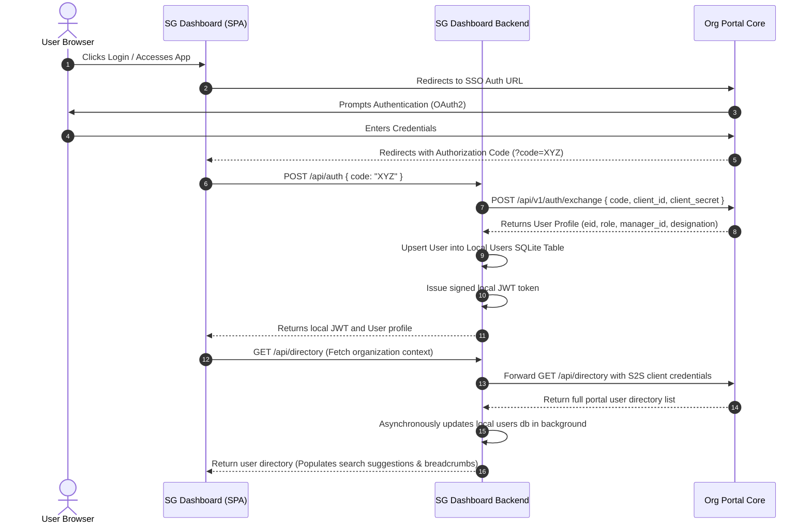
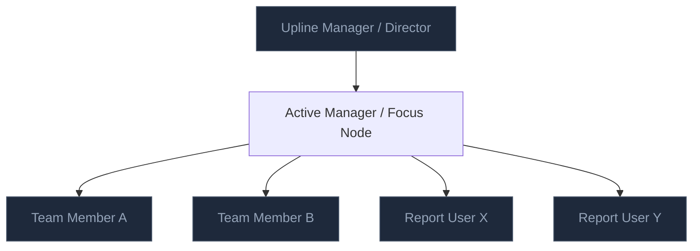
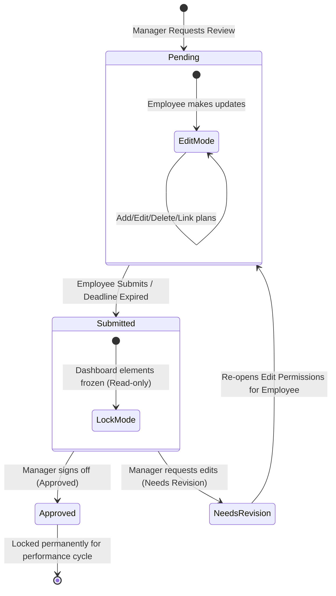

# Technical Documentation: TRR Strategy SG Dashboard

This document details the architectural topology, database schema design, REST API specifications, frontend module layout, and complete operational workflows for the **TRR Strategy SG_Dashboard** microservice application.

---

## 1. Architectural Topology & System Flow

The SG Dashboard is a decoupled microservice within the Forge Application framework. It is designed to scale efficiently (**supporting 1,000+ concurrent users**) while consuming minimal resources (**less than 1GB of RAM**). It achieves this by using localized SQLite database isolation, enabling WAL (Write-Ahead Logging) mode, utilizing stateless JSON Web Tokens (JWT) for authentication, and caching directory metadata locally.

### 1.1 System Architecture Diagram
The system structure below highlights the interaction between the frontend SPA, the Fastify backend, and the parent Next.js organization portal:

```mermaid
graph TD
    subgraph Client-Side (SPA)
        UI[Vanilla JS View Manager - ui.js] <--> AppState[State & Router Controller - app.js]
        AppState <--> Net[Asynchronous Network Client - api.js]
        AppState <--> Sidebar[Sidebar Layout Controller - sidebar.js]
    end

    subgraph SG Dashboard Backend (Fastify)
        Server[Fastify API Server - server.ts]
        Router[API Route Modules]
        AuthMD[JWT Validation Middleware - auth.ts]
        LibSQL[(libSQL / SQLite Database)]
        
        Server --> Router
        Router --> AuthMD
        Router --> LibSQL
    end

    subgraph Organization Portal Core
        Portal[Main Next.js Org Portal]
        PG[(Postgres Database)]
        Portal --> PG
    end

    Net <-->|HTTPS / JSON / JWT| Server
    Router <-->|S2S Handshake & Sync API| Portal
```

---

### 1.2 Authentication & Directory Handshake
Federated Single Sign-On (SSO) and metadata caching ensure secure operation without introducing query latency:



---

## 2. Database Schema Design

The microservice uses a volume-isolated libSQL/SQLite database engine (typically stored at `volume/local.db` or `/app/db/local.db` inside container volumes). The schema consists of six relational tables, optimized with indexes and automatic triggers.

### 2.1 Table Schema Details

#### Table: `users`
Stores user profile information synced from the organization portal directory. Defines permissions and reporting relationships.
* **Fields:**
  | Field Name | Data Type | Constraints / Attributes | Description |
  | :--- | :--- | :--- | :--- |
  | `id` | `TEXT` | `PRIMARY KEY` | Local unique identifier (mapped to Employee ID/EID) |
  | `name` | `TEXT` | `NOT NULL` | Full name of the user |
  | `email` | `TEXT` | `NOT NULL`, `UNIQUE` | E-mail address for SSO and alerts |
  | `role` | `TEXT` | `NOT NULL`, `CHECK(role IN ('Employee', 'Manager', 'Admin'))` | Application access permissions |
  | `manager_id` | `TEXT` | `NULLABLE` | Points to manager's `users.id` |
  | `designation` | `TEXT` | `NULLABLE` | User's job title (e.g., L5 Engineer) |
* **Indexes:** `idx_users_manager_id` on `manager_id`, `idx_users_name` on `name`, `idx_users_email` on `email`.

#### Table: `dashboards`
Stores program-specific dashboards containing strategic objectives, operational notes, and trash statuses.
* **Fields:**
  | Field Name | Data Type | Constraints / Attributes | Description |
  | :--- | :--- | :--- | :--- |
  | `id` | `TEXT` | `PRIMARY KEY` | Unique dashboard UUID |
  | `user_id` | `TEXT` | `NOT NULL`, `FOREIGN KEY` -> `users(id)` | Owner of the dashboard plan |
  | `program_line` | `TEXT` | `DEFAULT 'Default Program'` | Active program focus area (e.g. AI/ML Enablement) |
  | `objective` | `TEXT` | `NULLABLE` | Personal development objective statement |
  | `notes` | `TEXT` | `NULLABLE` | Managerial & operational comment notes |
  | `is_deleted` | `INTEGER` | `DEFAULT 0` | Soft delete flag (0 = active, 1 = deleted) |
  | `deleted_at` | `TEXT` | `NULLABLE` | Timestamp when soft deleted |
  | `updated_at` | `DATETIME`| `DEFAULT CURRENT_TIMESTAMP` | Last updated timestamp |
* **Indexes:** `idx_dashboards_user_id` on `user_id`.

#### Table: `dashboard_versions`
Maintains version snapshots of a dashboard, enabling users to checkpoint and restore dashboard states.
* **Fields:**
  | Field Name | Data Type | Constraints / Attributes | Description |
  | :--- | :--- | :--- | :--- |
  | `id` | `TEXT` | `PRIMARY KEY` | Version snapshot UUID |
  | `dashboard_id` | `TEXT` | `NOT NULL`, `FOREIGN KEY` -> `dashboards(id) ON DELETE CASCADE` | Link to parent dashboard |
  | `version_name` | `TEXT` | `NOT NULL` | Description/label of the saved snapshot |
  | `snapshot` | `TEXT` | `NOT NULL` | JSON serialized string of dashboard metadata, items, and links |
  | `created_at` | `DATETIME`| `DEFAULT CURRENT_TIMESTAMP` | Version creation timestamp |
* **Indexes:** `idx_dashboard_versions_dashboard_id` on `dashboard_id`.

#### Table: `dashboard_items`
Contains the individual strategic elements inside a dashboard, classified into Key Skills, Skill Gaps, or Training Plans.
* **Fields:**
  | Field Name | Data Type | Constraints / Attributes | Description |
  | :--- | :--- | :--- | :--- |
  | `id` | `TEXT` | `PRIMARY KEY` | Item UUID |
  | `dashboard_id` | `TEXT` | `NOT NULL`, `FOREIGN KEY` -> `dashboards(id) ON DELETE CASCADE` | Link to parent dashboard |
  | `section` | `TEXT` | `NOT NULL`, `CHECK(section IN ('key_skill', 'gap', 'training_plan'))` | Column category |
  | `category` | `TEXT` | `NULLABLE` | Sub-category prefix (e.g. `Core:Low`, `Strategic:Critical`, `Tactical:TIME`) |
  | `title` | `TEXT` | `NOT NULL` | Display text of the item |
  | `description` | `TEXT` | `NULLABLE` | Detailed notes |
  | `deadline` | `TEXT` | `NULLABLE` | Targets |
  | `status` | `TEXT` | `DEFAULT 'not_started'` | Progression state (e.g., `not_started`, `in_progress`, `completed`) |
  | `target_quarter` | `TEXT` | `NULLABLE` | Target quarter (e.g., Q3-2026) |
  | `completed_quarter`| `TEXT` | `NULLABLE` | Actual quarter completed |
* **Indexes:** `idx_dashboard_items_dashboard_id` on `dashboard_id`.

#### Table: `dashboard_item_links`
Represents relational dependencies (linking lines) between items. Maps connections like *Key Skill* $\rightarrow$ *Skill Gap* $\rightarrow$ *Training Plan*.
* **Fields:**
  | Field Name | Data Type | Constraints / Attributes | Description |
  | :--- | :--- | :--- | :--- |
  | `id` | `TEXT` | `PRIMARY KEY` | Relation UUID |
  | `dashboard_id` | `TEXT` | `NOT NULL`, `FOREIGN KEY` -> `dashboards(id) ON DELETE CASCADE` | Link to dashboard context |
  | `source_id` | `TEXT` | `NOT NULL`, `FOREIGN KEY` -> `dashboard_items(id) ON DELETE CASCADE` | Starting item |
  | `target_id` | `TEXT` | `NOT NULL`, `FOREIGN KEY` -> `dashboard_items(id) ON DELETE CASCADE` | Linked target item |
* **Constraints:** `UNIQUE(source_id, target_id)` prevents circular duplicate linkages.
* **Indexes:** `idx_dashboard_item_links_dashboard_id`, `idx_dashboard_item_links_source_id`, `idx_dashboard_item_links_target_id`.

#### Table: `submission_requests`
Manages formal plan verification requests issued by managers, submission state locks, and review results.
* **Fields:**
  | Field Name | Data Type | Constraints / Attributes | Description |
  | :--- | :--- | :--- | :--- |
  | `id` | `TEXT` | `PRIMARY KEY` | Submission UUID |
  | `manager_id` | `TEXT` | `NOT NULL`, `FOREIGN KEY` -> `users(id)` | Assigning Manager |
  | `employee_id` | `TEXT` | `NOT NULL`, `FOREIGN KEY` -> `users(id)` | Targeted employee |
  | `dashboard_id` | `TEXT` | `NULLABLE`, `FOREIGN KEY` -> `dashboards(id) ON DELETE SET NULL` | Snapshot of submitted dashboard |
  | `deadline` | `TEXT` | `NOT NULL` | Due date for completion |
  | `status` | `TEXT` | `DEFAULT 'Pending'`, `CHECK(status IN ('Pending', 'Submitted', 'Approved', 'Needs Revision'))` | Pipeline progress status |
  | `feedback` | `TEXT` | `NULLABLE` | Comments provided by the manager |
  | `submitted_at` | `TEXT` | `NULLABLE` | ISO Timestamp of submission |
  | `reviewed_at` | `TEXT` | `NULLABLE` | ISO Date of sign-off |
* **Indexes:** `idx_submission_requests_employee_id` on `employee_id`.

---

### 2.2 Database Triggers
To maintain data integrity and optimize dirty-state queries, SQLite triggers automatically bump `dashboards.updated_at` to `CURRENT_TIMESTAMP` whenever child tables are modified:

* **`trg_dashboard_items_update` / `trg_dashboard_items_insert` / `trg_dashboard_items_delete`**:
  ```sql
  CREATE TRIGGER IF NOT EXISTS trg_dashboard_items_update
  AFTER UPDATE ON dashboard_items
  BEGIN
    UPDATE dashboards SET updated_at = CURRENT_TIMESTAMP WHERE id = NEW.dashboard_id;
  END;
  ```
* **`trg_dashboard_item_links_insert` / `trg_dashboard_item_links_delete`**:
  ```sql
  CREATE TRIGGER IF NOT EXISTS trg_dashboard_item_links_insert
  AFTER INSERT ON dashboard_item_links
  BEGIN
    UPDATE dashboards SET updated_at = CURRENT_TIMESTAMP WHERE id = NEW.dashboard_id;
  END;
  ```

---

## 3. REST API Specifications

All API endpoints are prefixed with `/api` (or `/forge-apps/:slug/api` when loaded via iframe proxy) and require a signed JWT token in the `Authorization: Bearer <TOKEN>` header, except for configuration and login endpoints.

### 3.1 Authentication & Directory Syncer

#### `POST /api/auth`
* **Purpose:** Handles the SSO token handshake. Exchanges an authorization code for a signed JWT token.
* **Payload:** `{ code: "AUTH_CODE_STRING" }`
* **Response (200 OK):**
  ```json
  {
    "success": true,
    "token": "JWT_TOKEN_STRING",
    "user": {
      "id": "EID123",
      "eid": "EID123",
      "name": "Arthur Pendragon",
      "email": "arthur@org.com",
      "role": "Manager",
      "designation": "L6 Director"
    }
  }
  ```

#### `POST /api/sync`
* **Purpose:** Synchronizes user directory structures from the portal to the local DB.
* **Authorization:** Requires local `Admin` permissions, or verifies that the sender is the upline manager of all target users.
* **Payload:** `{ users: [{ id, name, email, manager_id, designation }] }`
* **Response (200 OK):** `{ "success": true, "synced": 5 }`

#### `GET /api/directory`
* **Purpose:** Proxy search query to portal core directory. Automatically falls back to localized SQLite lookup if the portal core is unreachable.
* **Params:** `q` (name/email search query) OR `managerId` (retrieve reports)
* **Response (200 OK):** `{ "users": [...] }`

---

### 3.2 Dashboard & Plan Management

#### `GET /api/dashboards`
* **Purpose:** Retrieves all active and soft-deleted dashboards for a user.
* **Params:** `userId` (Owner EID), `includeDeleted` (boolean)
* **Authorization:** Verified as self, Admin, or upline manager.
* **Response:** List of program dashboards, including their last submission states.

#### `GET /api/dashboard`
* **Purpose:** Retrieves details for a specific dashboard. Automatically creates a default dashboard if the user has no dashboards initialized.
* **Params:** `dashboardId` (Optional UUID)
* **Response (200 OK):**
  ```json
  {
    "dashboard": { "id": "uuid", "user_id": "eid", "program_line": "AI/ML Enablement", "objective": "...", "notes": "..." },
    "items": [ { "id": "item-uuid", "section": "key_skill", "title": "PyTorch", "category": "Core:Critical" } ],
    "links": [ { "id": "link-uuid", "source_id": "item1-uuid", "target_id": "item2-uuid" } ]
  }
  ```

#### `GET /api/dashboard/:userId`
* **Purpose:** Allows managers to retrieve an employee's dashboard details.
* **Params:** `dashboardId` (Optional UUID)
* **Authorization:** Checked against `checkUplineManager(requesting_user, target_userId)` to enforce data boundaries.

#### `POST /api/dashboard`
* **Purpose:** Creates a new program dashboard for the authenticated user.
* **Payload:** `{ "program_line": "Cloud Architecture" }`

#### `POST /api/dashboard/:id/duplicate`
* **Purpose:** Deep-clones a dashboard. Duplicates metadata, all items (new UUIDs generated), and mapping link associations.

#### `POST /api/dashboard/:id/links`
* **Purpose:** Replaces all link associations originating from a single source node.
* **Payload:** `{ "source_id": "uuid", "target_ids": ["uuid1", "uuid2"] }`

---

### 3.3 Dashboard Versioning Controls

#### `POST /api/dashboard/:id/versions`
* **Purpose:** Commits a JSON snapshot of the active dashboard state to the database.
* **Payload:** `{ "version_name": "Before mid-year reviews" }`

#### `POST /api/dashboard/:id/versions/:versionId/restore`
* **Purpose:** Restores a version snapshot. Replaces the active dashboard's items and links inside a single SQL transaction.

---

### 3.4 Submission Workflows

#### `POST /api/submissions`
* **Purpose:** Issued by managers to request a dashboard plan verification deadline.
* **Payload:** `{ "employee_id": "EID", "deadline": "YYYY-MM-DD", "dashboard_id": "UUID" }`

#### `POST /api/submissions/:id/submit`
* **Purpose:** Locks the employee's dashboard plan and updates status to `Submitted`.
* **Payload:** `{ "dashboard_id": "UUID" }`
* **Behavior:** Locks the active dashboard and logs a real-time console notification.

#### `POST /api/submissions/:id/review`
* **Purpose:** Allows a manager to verify or request revision on a plan.
* **Payload:** `{ "status": "Approved" | "Needs Revision", "feedback": "Comments..." }`
* **Behavior:** `Approved` locks the plan permanently. `Needs Revision` re-enables editing permissions.

#### `POST /api/submissions/:id/freeze`
* **Purpose:** Issued by a manager or administrator to freeze and auto-submit a pending request using the employee's last active dashboard snapshot.

---

## 4. Frontend Architecture & State Flow

The front-end client interface is written using vanilla ES6 JavaScript modules, avoiding heavy compilation pipelines. It leverages TailwindCSS utility tokens along with theme variables from a custom CSS stylesheet.

### 4.1 Module Structure
* **`index.html`**: The single-page application structure. Contains layouts, control sidebars, modal structures, and template markup.
* **`styles.css`**: Defines custom components, dark mode adjustments, scrollbars, dynamic glassmorphism cards, and interactive hover animations.
* **`js/api.js`**: Low-level network wrapper. Handles async fetch commands, injects JWT headers, and resolves path mappings.
* **`js/sidebar.js`**: Controls sidebar drag-resizing, snaps states, and binds key listeners (like `Ctrl+B`).
* **`js/ui.js`**: High-performance DOM manipulator. Renders table lists, nodes, links, badge states, and org explorers.
* **`js/app.js`**: Core controller. Manages sessionStorage state, handles context switches, and initiates smart syncing.

---

### 4.2 Modern Org Chart Explorer
The application features an Org Chart Explorer that visualizes structural relations. It renders parent nodes, sibling elements, and child reports relative to the selected employee:



---

## 5. In-Depth Operational Workflows

### 5.1 Formulation of Strategy Items
The development plan features an interactive 3-column layout where items can be dynamically linked:

```
[Key Skill Node] ------------> [Skill Gap Node] ------------> [Training Plan Node]
e.g. "Kubernetes"             e.g. "High Scale"             e.g. "CKA Certification"
Section: key_skill            Section: gap                  Section: training_plan
Category: Core                Category: Critical            Category: Strategic
```

1. **Category Toggling:** Clicking severity tags cyclically updates category prefixes (e.g. low $\rightarrow$ medium $\rightarrow$ critical).
2. **Dynamic Badging:** Badges in Column 3 are adjusted dynamically (e.g. Strategic plans cycle between `TRAIN`, `TIME`, `ACTION`, and `DEADLINE`).
3. **Relation Links:** When a node in Column 1 or 2 is clicked, connection endpoints open. Clicking target cards records dependencies in `dashboard_item_links`.

---

### 5.2 Lock and Review Pipeline
Below is the plan submission and sign-off state machine:



1. **Auto-Submit Daemon:** The server triggers `autoSubmitExpiredRequests` on submissions endpoints. If a request is `Pending` past its deadline date, it is frozen and submitted using the latest dashboard snapshot.
2. **Review Panel Layout:** Selecting a report from the list opens a split-screen layout. The manager views the employee's plan side-by-side with feedback forms, comments, and decision actions.

---

## 6. Containerization & Service Topology

The service is containerized using a lightweight Docker environment running Bun. This ensures rapid startup times and minimal host dependency overhead.

### 6.1 Service Topology
* **Base Base Image:** Built on top of `oven/bun:1`.
* **Database Isolation:** Utilizes a persistent volume mount mapped directly to `/app/db/` to prevent database loss during container restarts.
* **Network Isolation:** Runs on a shared proxy bridge network named `sgforge-network`. Allows localized, direct routing between services (`http://app:3001` or `http://host.docker.internal:3001` for the parent portal core).
* **PM2 Clustering:** In production settings, PM2 clusters are initialized to spin up worker threads per CPU core, maximizing concurrency and keeping memory usage below the 1GB limit.
