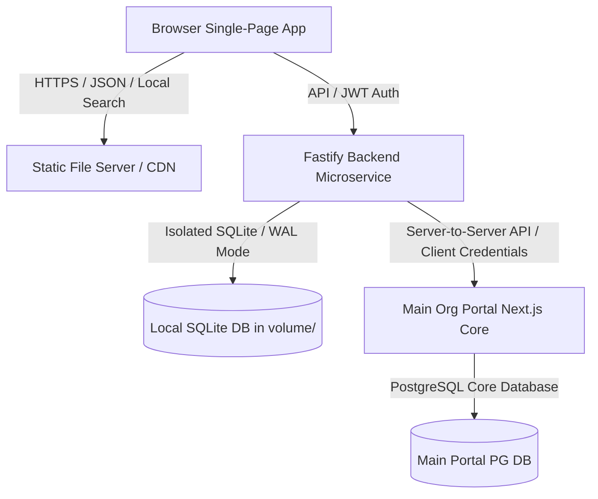

# High-Performance Microservice Architecture: SG Dashboard

This architecture document details how the SG Dashboard microservice is designed, how it integrates with the parent organization portal, and how it scales to support **1,000+ concurrent users** while consuming **less than 1GB of RAM**.

---

## 1. System Topology

The dashboard is structured as a decoupled microservice. It uses localized database isolation for high-performance transactions, and a Server-to-Server (S2S) security proxy for directory metadata and federated authentication (SSO).



---

## 2. Authentication & Data Flow

### 1. Federated SSO Handshake
* **SSO Redirect:** The client starts authentication by requesting authorization from the main portal.
* **Token Exchange:** The microservice acts as an OAuth2 client, exchanging the authorization code for a signed JWT token via `/api/auth` S2S call, using its secret credentials (`clientId` and `clientSecret`).
* **Stateless JWTs:** Upon verification, the microservice issues a stateless JWT to the client. This token is verified on every subsequent request without hitting any external authentication database.

### 2. User Directory Caching & Instant Search
* **Background Pre-fetch:** At client startup, the application pre-fetches the entire user directory from the portal and stores it in the browser's memory (`cachedUsers`).
* **Sub-millisecond Search:** Keystroke searches are filtered directly in client-side memory across name, email, and designation. This eliminates backend API calls on every keystroke and prevents database read congestion.
* **Database Sync:** Changes to designations, managers, and roles are synchronized with the parent portal database and persisted locally inside the isolated SQLite storage.

---

## 3. Storage and Scaling Strategy

### 1. Volume-Isolated Database
* The SQLite database is located inside the dedicated `volume/` directory (e.g. `volume/local.db`), enabling direct volume mounting for container environments (like Docker/Kubernetes) and easy backups.
* The application automatically configures `PRAGMA foreign_keys = ON` and indexes search properties (e.g. `manager_id`, `name`, `email`) for maximum retrieval speed.

### 2. Write-Ahead Logging (WAL) Mode
By enabling WAL mode, SQLite executes read and write operations concurrently:
```sql
PRAGMA journal_mode = WAL;
PRAGMA synchronous = NORMAL;
PRAGMA temp_store = MEMORY;
```
* **Performance Impact:** Reader transactions do not block writers, and writer transactions do not block readers. Temp files are held in RAM rather than written to disk, removing I/O latency.

### 3. Resource & RAM Constraints (< 1GB RAM)
* **Lightweight Stack:** The backend utilizes **Fastify**, a zero-overhead Node.js web framework. PM2 clustering runs 1 worker per CPU core.
* **Memory Footprint:** Each worker consumes ~100MB of RAM. A standard 4-core container cluster uses ~400MB of RAM, allowing the service to run comfortably within a 1GB resource limit.
* **High Concurrency:** Fastify's schema-based serialization allows serialization of JSON payloads up to 2x faster than default `JSON.stringify()`, maximizing CPU efficiency.
